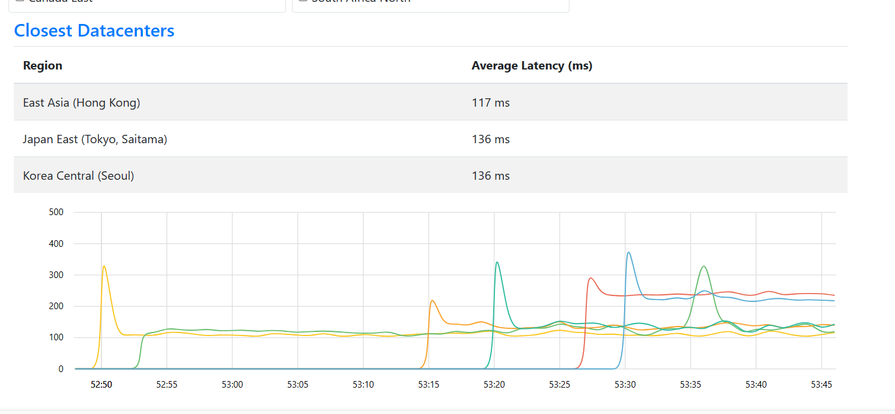
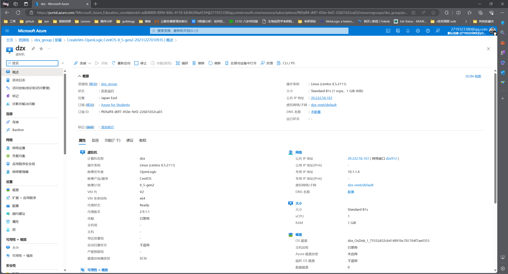

# 新建Azure's VPS

整Azure教育优惠，为期一年的超级自制VPS之旅 开整！！！

## 创建Azure实例

创建linux虚拟机

区域是服务器所在的数据中心位置，这个选项会影响连接服务器的延时。一般来说，选择周边的国家和地区速度会快一些。可以在[Azure Latency Test](https://link.zhihu.com/?target=https%3A//www.azurespeed.com/Azure/Latency)这个网站测试你的网络到不同数据中心的延时，也可以看到不同区域选项对应的真实地理位置，比如说East Asia对应的就是香港。如果你想通过服务器使用一些国外的服务，你也可能需要考虑一下服务器的位置。比如说要使用OpenAI的Chatgpt等服务，就不要选择East Asia。



延迟差距不大，为了省去备案以及日后折腾一些服务的麻烦，我这里就选择Japan East

剩下按照流程创建，选择系统版本balabala

其中：

映像就是服务器的操作系统。Linux系统的发行版众多，主要有Redhat和Debian两大分支。Redhat系下有RHEL，CentOS，Fedara等，Debian系下有Debian和Ubuntu等，除了这两系外还有许多其他的发行版。不同发行版的命令有一些差异，软件包也不同。

我手边有一本鸟叔的基础的Linux工具书，跟着书的版本选择Centos系列

总之我的Azure白嫖的vps创建好了



## 密码以及免密登录

### 启用root用户登录 & 密码登录

#### 修改配置文件

Azure下使用资源虚拟机时默认创建新用户 `azureuser`，名称可以自己改，但是禁止了以 `root`用户登录，我们可以通过修改 `/etc/ssh/sshd_config` (ssh配置文件)

```shell
sudo -i #切换至root用户
vi /etc/ssh/sshd_config
```

在vim界面底层命令行模式下，可以使用 `/<key>`快速定位需要修改的地方

我这里使用 `/PermitRootLogin` `/PasswordAuthentication` 修改成yes,启用root用户登录以及密码登录

    在原处修改注意删除前面的注释符号`#`

#### 修改密码

记得修改root以及自己用户密码

`sudo passwd <username>`

```shell
[root@dzx ~]# su -griedzx #切换用户

[griedzx@dzx ~]$ sudo passwd griedzx
Changing password for user griedzx.
New password: 
Retype new password: 
passwd: all authentication tokens updated successfully.
```


重启实例后 `Reboot`再ssh连接

