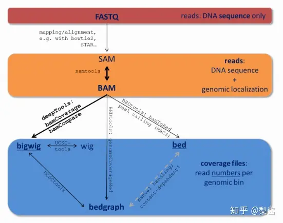
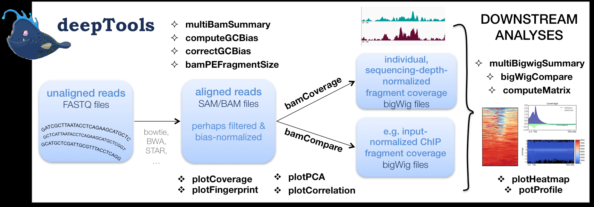

# deeptools_computeMatrix使用介绍

## 文件格式

* BED (Browser Extensible Data),一种灵活的储存数据的格式，主要用来 **储存基因组特征** （genomic features） **或注释信息(*.summits.bed)** 。

  BED格式可用于UCSC的Genome Browser可视化工具中
* 挖掘生物数据信息时，我们会将进行序列比对（未知的序列与已知的reference对比，从而找到未知序列中隐藏的信息），常见的序列比对的文件输出格式为sam和bam

  Sequence Alignment Mapping (SAM) 格式包括两部分：1. 注释信息（header section）2. 比对结果（alignment section）

  Binary Alignment/Map (BAM)是SAM格式的二进制压缩格式，这两种格式是序列比对时软件常用的数据格式



* sam/bam格式文件，就是把测序reads比对到参考基因组后的文件
* bam或者bed格式的文件主要是为了追踪我们的reads到底比对到了参加基因组的什么区域

## deeptools功能



## Deeptools 对 ChIP-seq 数据进行图形呈现

### bam文件转换成bw文件格式

将bam文件转换为bigwig文件，这是一种压缩的二进制格式，可以快速加载和显示

```shell
bamCoverage -e 170 -bs 10 -b ap2_chip_rep1_2_sorted.bam -o ap2_chip_rep1_2.bw
#ap2_chip_rep1_2_sorted.bam是前期比对得到的BAM文件
```

得到的bw文件就可以送去IGV/Jbro wse进行可视化。 这里的参数仅使用了 `-e/--extendReads`和 `-bs/--binSize`即拓展了原来的read长度，且设置分箱的大小。其他参数还有

- `--filterRNAstrand {forward, reverse}`: 仅统计指定正链或负链
- `--region/-r CHR:START:END`: 选取某个区域统计
- `--smoothLength`: 通过使用分箱附近的read对分箱进行平滑化

如果为了其他结果进行比较，还需要进行标准化，deeptools提供了如下参数：

- `--scaleFactor`: 缩放系数
- `--normalizeUsingRPKMReads`: Per Kilobase per Million mapped reads (RPKM)标准化
- `--normalizeTo1x`: 按照1x测序深度(reads per genome coverage, RPGC)进行标准化
- `--ignoreForNormalization`： 指定那些染色体不需要经过标准化

### computeMatrix

计算每个基因组区域的得分，并生成一个可与 ``plotHeatmap`` 和 ``plotProfiles`` 一起使用的中间文件。

```shell
Required arguments:
  --regionsFileName File [File ...], -R File [File ...]
                        File name or names, in BED or GTF format, containing the regions to plot. If multiple bed files are given, each one is considered a group that can be plotted separately. Also, adding a "#" symbol in the bed file causes all the regions until the previous "#" to be considered one group.(default: None)
  --scoreFileName File [File ...], -S File [File ...]
                        bigWig file(s) containing the scores to be plotted. Multiple files should be separated by spaced. BigWig files can be obtained by using the bamCoverage or bamCompare tools. More information about the bigWig file format can be found at http://genome.ucsc.edu/goldenPath/help/bigWig.html(default: None)

```

`computeMatrix` 有两种主要的使用模式/参数


#### computeMatrix reference-point

reference-point 计算的基因组区域以某一个位置点作为相对参考点

`--referencePoint {TSS,TES,center}`

* region start (TSS)
* the region end(TES)
* the center of the region （默认为TSS）

#### computeMatrix scale-regions

scale-regions 计算的基因组区域为一段设定的区域长度（-b -a -m三个参数设置控制）

```shell
#对单一样本绘图
computeMatrix scale-regions \
-S shoot_ATAC-seq.bigwig \
-R gene_length.bed \
-b 1000 -a 1000 \
-bs 50 \
--skipZeros \
-o matrix1_shoot_all.gz --outFileSortedRegions region1_shoot_genes.bed

plotHeatmap -m matrix1_shoot_all.gz -out shoot_Heatmap.png
```

```shell

```

## 参考

[computeMatrix — deepTools 3.2.1 documentation (test-argparse-readoc.readthedocs.io)](https://test-argparse-readoc.readthedocs.io/en/latest/content/tools/computeMatrix.html)

[[生信资料 3] 生物信息学常见数据格式，汇总！ - 知乎 (zhihu.com)](https://zhuanlan.zhihu.com/p/67402565)

[[软件使用05] 快速使用 Deeptools 对 ChIP-seq 数据画图！ - 知乎 (zhihu.com)](https://zhuanlan.zhihu.com/p/166282791)

[ATAC-seq-TSS富集图-deeptools-学习笔记 - 知乎 (zhihu.com)](https://zhuanlan.zhihu.com/p/434546334)

