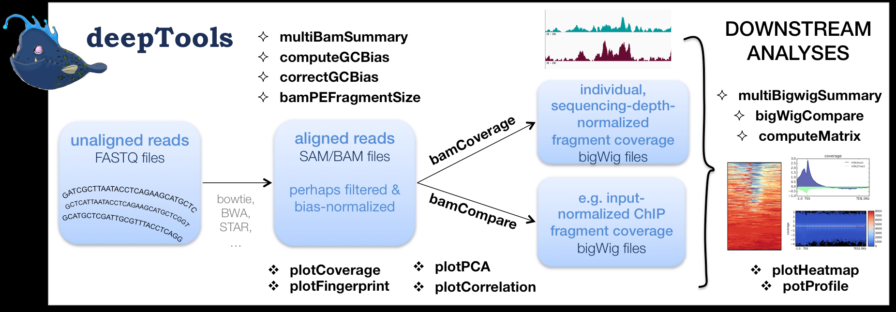

# deeptools_peaks可视化

## 文件格式

* BED (Browser Extensible Data),一种灵活的储存数据的格式，主要用来 **储存基因组特征** （genomic features） **或注释信息** 。

  BED格式可用于UCSC的Genome Browser可视化工具中
* 挖掘生物数据信息时，我们会将未知的序列与已知的reference对比，从而找到未知序列中隐藏的信息。这就是序列比对。常见的序列比对的文件输出格式为sam和bam

  Sequence Alignment Mapping (SAM) 格式包括两部分：1. 注释信息（header section）2. 比对结果（alignment section）

  Binary Alignment/Map (BAM)是SAM格式的二进制压缩格式，这两种格式是序列比对时软件常用的数据格式

* sam/bam格式文件，就是把测序reads比对到参考基因组后的文件
* bam或者bed格式的文件主要是为了追踪我们的reads到底比对到了参加基因组的什么区域

## deeptools功能

## Deeptools 对 ChIP-seq 数据进行图形呈现

### bam文件转换成bw文件格式

将bam文件转换为bigwig文件，这是一种压缩的二进制格式，可以快速加载和显示

`bamCoverage -b <bw> `

## 参考

[[生信资料 3] 生物信息学常见数据格式，汇总！ - 知乎 (zhihu.com)](https://zhuanlan.zhihu.com/p/67402565)

[deepTools 使用指南 - 台部落 (twblogs.net)](https://www.twblogs.net/a/5cc19761bd9eee3aed7895c3)

[[软件使用05] 快速使用 Deeptools 对 ChIP-seq 数据画图！ - 知乎 (zhihu.com)](https://zhuanlan.zhihu.com/p/166282791)

[ATAC-seq-TSS富集图-deeptools-学习笔记 - 知乎 (zhihu.com)](https://zhuanlan.zhihu.com/p/434546334)

