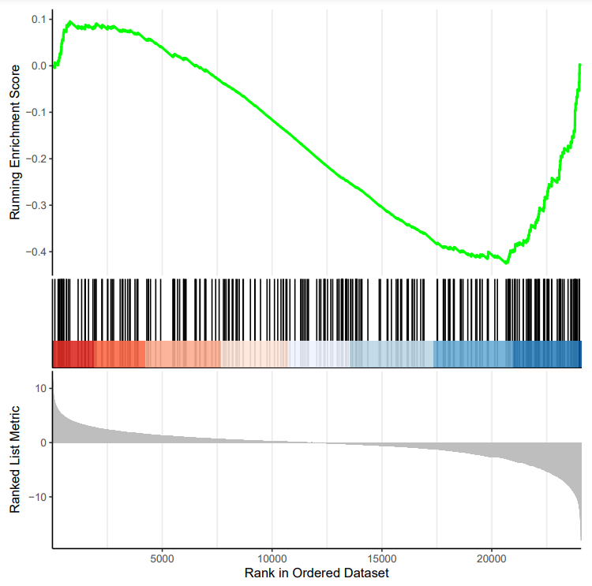
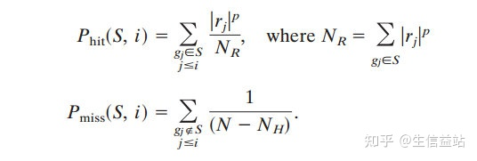
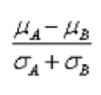

# GSEA结果理解

## GSEA目的

基因集富集分析（Gene Set Enrichment Analysis，GSEA）就可以**挖掘不同样品不同状态潜在的分子机制** 

GSEA判断来自功能注释等预定义的基因集或自定义的基因集是否倾向于落在有序列表的顶部或底部，也就是说**预定义基因集中大部分的基因是否在样品中高表达或者低表达，从而判断功能注释基因集在不同的样品中有没有发生显著变化**

## GSEA的结果图

GSEA的结果图通常包含三个部分：

### **富集分数（Enrichment Score）的折线图** 

横轴代表排序后的基因，纵轴为对应的Running ES。在折线图中出现的峰值就是这个基因集的富集分数（Enrichment Score，ES）。ES是从排序后的表达基因集的第一个基因开始，如果排序表达基因集中的基因出现在功能基因数据集中则加分，反之则减分。正值说明在顶部富集，峰值左边的基因为核心基因，负值则相反。

#### 富集分数（ES）

`正值ES`表示基因 在功能注释基因集的顶部富集，`负值ES`表示基因 在功能注释基因集的底部富集。

### **基因位置图** 

黑线代表排序后表达数据集中的基因存处于当前分析的功能注释基因集的位置

红蓝相间的热图是表达丰度排列，红色越深的表示该位置的基因logFC越大，蓝色越深表示logFC越小。如果研究的功能注释基因集的成员显著聚集在表达数据集的顶部或底部，则说明功能基因数据集中的基因在数据集中高表达或低表达，若随机分配，则说明表达数据集与该通路无关。

### **信噪比（Signal2Noise）** 

每个基因对应的信噪比以灰色面积图显示。灰色阴影的面积比，可以从整体上反映组间的Signal2Noise的大小。

在GSEA（基因集富集分析）中，信噪比（Signal-to-Noise Ratio）是一种度量方法，用于对基因进行排序。这种排序方法是根据基因在两种样品中的差异表达程度或者表型相关度进行排序^1^^2^。

具体来说，信噪比的计算方法如下^1^^2^：

1. 首先，对所有基因按照它们在两种样品中的差异表达程度（如logFC）或者表型相关度进行排序。
2. 然后，对于每一个基因，计算它在样品A中的平均表达量和样品B中的平均表达量的差值。这个差值就是该基因的信噪比。

在GSEA的结果展示图中，每个基因对应的信噪比以灰色面积图显示^1^^2^。灰色阴影的面积比，可以从整体上反映组间的Signal2Noise的大小^1^^2^。

有效的条件

**NES** ：校正后的归一化的ES值。
由于不同用户输入的基因数据库文件中的基因集数目可能不同，富集评分的标准化考虑了基因集个数和大小。
其绝对值大于 `1`为一条富集标准。

在上图中，我们一般关注ES值，峰出现在排序基因集的前端还是后端（ES值大于0在前端，小于0在后端）以及 `Leading edge subset`（即对富集贡献最大的部分，领头亚集）；在ES图中出现领头亚集的形状，表明这个功能基因集在某处理条件下具有更显著的生物学意义；对于分析结果中，我们一般认为 `|NES|>1，NOM p-val<0.05，FDR q-val<0.25`的通路是显著富集的。

## 参考

[GSEA第2弹！如何解读GSEA富集结果 - 知乎 (zhihu.com)](https://zhuanlan.zhihu.com/p/582401881)

[史上最全GSEA可视化教程，今天让你彻底搞懂GSEA！ - 知乎 (zhihu.com)](https://zhuanlan.zhihu.com/p/393056080)

[一文掌握GSEA，超详细教程！ - 知乎 (zhihu.com)](https://zhuanlan.zhihu.com/p/352628317)

