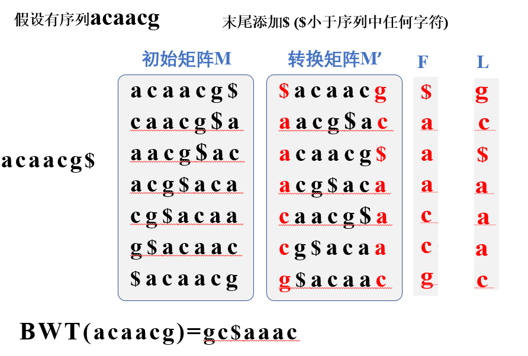

# 生物信息原理复习

**人类基因组计划（HGP）**

目标：整体上破解人类遗传信息的奥秘

测序数据：30亿个碱基对，2~3万个基因，约3个G

四个图：遗传图、物理图、序列图、基因图

## 测序技术

sanger测序步骤

1. 分离待测核酸样本
2. 在反应体系中加入适当引物、模板、DNA聚合酶、dNTP、带荧光标记的ddNTP
3. DNA合成
4. 凝胶电泳分离反应产物
5. 放影自显影

Illumina

在小型芯片上进行桥式PCR反应,每次只合成一个碱基，并标记荧光基团,再利用相应的激光激发荧光基团，捕获激发光，从而读碱基信息

可以很好解决同聚物长度的准确测量问题

碱基的替换会造成测序错误且读取序列较短给de novo sequencing拼接带来困难

|          | 代表                             | 测序基础                                                                                                     | 优点                                                                          | 缺点                                    |
| -------- | -------------------------------- | ------------------------------------------------------------------------------------------------------------ | ----------------------------------------------------------------------------- | --------------------------------------- |
| 一代测序 | sanger(合成终止测序)             | ddNTP为测序反应的链终止剂                                                                                    | 准确率高 读长较长 可达1000bp                                            | 电泳分离速度低 成本难以降低        |
| 二代测序 | 454 Illumina SOLiD     | 单个小片段DNA分子结合到固相表面 扩增复制检测信号                                                        | 较一代测序 降低成本 准确率较高 测序时间较快                         | 读长短 （DNA簇中存在光学信号移项） |
| 三代测序 | PacBio-SMRT Oxford-Nanopore | 单分子测序技术 DNA聚合酶和模板结合,4色荧光标记 4 种碱基 在碱基配对阶段,不同碱基的加入,会发出不同光 | 读长较长，减少拼接成本 降低内存和计算时间 原理长避免pcr扩增引入错误 | 依赖DNA聚合酶活性 成本昂贵         |

**一、二、三代测序技术的比较**

第一代和第二代测序技术除了通量和成本上的差异之外，其测序核心原理（除Solid是边连接边测序之外）都是基于边合成边测序的思想。第二代测序技术的优点是成本较之一代大大下降，通量大大提升，但缺点是所引入PCR过程会在一定程度上增加测序的错误率，并且具有系统偏向性，同时读长也比较短。第三代测序技术是为了解决第二代所存在的缺点而开发的，它的根本特点是单分子测序，不需要任何PCR的过程，这是为了能有效避免因PCR偏向性而导致的系统错误，同时提高读长，并要保持二代技术的高通量，低成本的优点。

## 数据库

**哪些数据可用于创建生物信息学数据库？**

①核苷酸序列（DNA或RNA的测序原始数据、基因组组装序列等）

②蛋白质序列与结构信息

③序列与结构注释信息（基因注释、功能注释）

④代谢路径信息（底物、产物、酶等）

**生物信息学数据库**

**核酸数据库**: 三大核酸数据库：GenBank（美）， ENA（欧），DDBJ（日）

**基因组数据库:** Genome

**高通量测序相关数据库:**

①BioProject：提交到NCBI的各种数据的项目描述

②BioSample：提交到NCBI的各种数据的样品描述

③SRA：存放高通量测序数据

④Assembly：各种基因组拼接的不同版本及信息

**蛋白质数据库**

①蛋白质序列数据库 UniProt

包含UniProtKB、UniRef、UniParc

UniProtKB可分为两个部分： **来源于实验的有详细注释的序列（SWISS-PROT）** 和**自动注释序列（TrEMBL）**

TrEMBL是自动化翻译获得的蛋白质数据库，不含二级结构信息

②蛋白质结构数据库——RCSB:**PDB**

③蛋白质功能域数据库

 **PROSITE** ：收集了生物学有显著意义的蛋白质位点和序列模式，并能根据这些位点和模式快速可靠地鉴别一个未知蛋白质序列应该属于哪一些蛋白质家族

 **Pfam** ：蛋白质家族数据库，根据多序列比对和隐马可夫模型将蛋白质分为不同家族

**NCBI数据库搜索过程中精简检索结果可以应用：**

 **1）** **使用Advanced search**

 **2）** **使用Limit**

 **3）** **直接输入搜索字段**

 **4）** **组合多次搜索结果**

 **5）** **不断增加关键词**

## 双序列比对

### 经典算法

* 全局比对 NW算法

  
* 局部比对 SW算法

  

gap 矩阵中横向移动则纵向表示的序列新增'-',反之横向新增

### 打分矩阵的构建以及异同

#### DNA替换矩阵

**PAM**

根据碱基环结构环数不同分为嘧啶和嘌呤，环数改变为颠换，环数不变为转换

#### 氨基酸替换矩阵

**PAM**

PAM-n中，n 越小，表示氨基酸变异的可能性越小；相似的序列之间比较应该选用n值小的矩阵，不太相似的序列之间比较应该选用n值大的矩阵（PAM-250用于约20%相同序列之间的比较）。

**BLOSUM**

亲缘关系较远蛋白质

BLOSUM-n中，n越小，表示氨基酸相似的可能性越小；相似的序列之间比较应该选用 n 值大的矩阵，不太相似的序列之间比较应该选用n值小的矩阵（BLOSUM62用于约62%相同序列之间的比较）

若双序列比对中，比对序列过长或者需要进行两两比对的序列多（搜库），还有其他算法

* Blast
* 基因组序列比对
* 短序列比对

### BLAST比对

#### 基本原理

1. 为序列A构建一个k-mer/k-tuple哈希表
2. 扫描序列B，找到hits(比对后得分大于t的片段)
   * 目标数据库中所有包含与上述词列表中词完全一样的序列(hit)
3. 扩展hits(使用SW算法扩展高得分片段对HSP（**高得分联配对**），这些片段的分值不会因为片段的延申而进一步升高)

#### BLAST比对/搜库的期望值（E-value）

期望值（E-value）是用来评估比对结果的**统计显著性**的指标。它表示在随机情况下，期望有多少次能够观察到与给定比对结果相同或更好的比对

1. BLAST首先计算比对结果的原始得分（raw score），该得分是根据比对序列的相似性和匹配程度计算得出的
2. BLAST将原始得分转换为比对的位点期望得分（expectation score）。这一步骤使用Karlin-Altschul统计模型，考虑了比对得分的分布以及数据库的大小
3. BLAST使用期望得分计算E-value，较小的E-value表示比对结果具有更高的显著性

Karlin-Altschul模型参数

| 程序                    | 特点                                                                                                                                                                                 |
| ----------------------- | ------------------------------------------------------------------------------------------------------------------------------------------------------------------------------------ |
| MegaBLAST               | 适用于在较大的基因组数据库中搜索高度相似的序列，通过使用较大的初始字典（word size）和较大的不匹配惩罚（mismatch penalty）来提高敏感性和比对速度。                                    |
| Discontiguous megaBLAST | 能够识别具有间隔的相似区域，在比对过程中允许较大的间隔，在研究具有结构重复或间隔重复的基因组区域时非常有用。                                                                         |
| PSI-BLAST               | 用位置特异权重矩阵(Position-Specific Scoring Matrix，PSSM)搜索数据库后再利用搜索的结果重新构建PSSM，然后用新的PSSM再次搜索数据库，反复迭代，这种迭代过程有助于发现较远的序列相似性。 |
| PHI-BLAST               | 专门用于搜索与序列模式（pattern）相匹配的蛋白质序列，这种序列特征模式可能代表某个翻译后修饰的发生位点，也可以代表一个酶的活性位点，或者一个蛋白质家族的结构域、功能域。              |

* 一致性(identity)：两条序列在同一位点上的核苷酸或者氨基酸残基完全相同
* 同源性(homoogy)：两条序列存在进化方面的关系，它们从一条共同的祖先序列进化而来。同源可以分为直系同源和旁系同源
* 相似性：两条序列在同一位点上的氨基酸残基的化学性质相似。相似性可以用百分比描述，但同源性不可以

### PSSM

PSSM（Position-Specific Scoring Matrix）是一种用于描述蛋白质或核酸序列中每个位置上残基的频率和保守性的矩阵。PSSM是通过进行多序列比对并计算每个位置上残基出现的频率来构建的。PSSM中的每个元素表示特定残基在该位置上出现的相对频率，通常使用得分表示。

### 信息熵

### 重测序

重测序分析是对已知基因组序列的物种进行DNA测序，并在此基础上完成个体或群体基因组层面上的分析。

## 序列拼接（基因组装）和短序列比对

### 如何获得全基因组（组装）的序列

* BAC by BAC
  * 构建BAC文库
  * 打碎成DNA片段
  * subclone 测序
  * DNA测序、组装
* whole geneme shotgun

### **基于Kmer分析，评估基因组大小**

设基因组大小为G，测序获得N条read，且每条长度均为L

故k-mer总数为：Knum = (L-K+1)*N

k-mer的期望测序深度为：Kdepth = [(L-K+1)/G]*N

则G = Knum / Kdepth

### 基因组序列组装的主要步骤

①选择一种或多种测序技术，对目标基因组测序

②基于测序数据，从头组装，得到contig序列

③使用一种或多种组学技术，将contig序列进一步连接，得到scaffold序列

④将scaffold序列定位到染色体上

### 二、三代测序数据在组装中的应用和各自优势

主流：

* 三代测序数据搭建contig
* 二代短片段数据纠错
* 利用BioNano/Hi-C等技术将contig连接成scaffold或者染色体水平

三代测序技术中PacBio可以

1. 克服序列中高GC含量或者重复序列多，以精细基因注释
2. 长片段填补二代测序数据组装中的gap以及连接contig成scaffold

### de Bruijn graph

将基因组组装问题转化为寻找欧拉超路的问题

### SOAPdenovo **组装原理及使用**

①构建测序文库

②序列k-mer化，构建de Bruijn图

③简化de Bruijn图

④确定断点并输出contig

⑤构建scaffold序列

⑥填充gap

### 基于三代长片段测序数据的从头组装流程

①比对测序原始读段

②纠正原始读段错误

③组装纠正后的读段

④纠正组装后的contig序列

### 组装质量评估

3c原则

1. 组装连续性 contiguity
   * N50/N90 数值越大，组装效果越好
   * L50/L90 数值越小，组装效果越好
2. 组装完整度 completeness
   * 读段回帖  组装读段重新比对会基因组，理论上能比对上的读段的比例越高，则组装完整性越好效果越好
   * LAI
   * BUSCO CEGMA   将某些物种共有的保守基因，比对到或通过其它方法检索基因组，根据能检索出的基因数量
   * K-mer 通过比较用于组装的测序读段含有的Kmer集合，与组装好的序列含有的Kmer集合，评估基因组组装的完整性
3. 组装准确率 correctness
   * 读段回帖
   * K-mer

### 短序列比对

#### BWT

##### 编码

对L列进行从小到大排序得到F列

##### 解码

## **分子进化与系统发育**

## 隐马科夫模型（HMM）和基因组注释

学习问题：向前向后算法（EM）

### 原核生物和真核生物基因组的特点及异同

原核基因组特点：染色体多为一条环状闭合双链DNA，编码序列占基因组总长度的90%，CG含量在16.6%-74.9%，DNA链组成的非对称分布

原核生物基因结构：

启动子-转录位点-5‘UTR-起始密码子-编码区-终止密码子-3’UTR-终止区

真核基因组特点

对基因预测影响

## 基因定位和全基因组关联分析

QTL,数量性状:在一个群体内表现为连续变异的形状，相对性状间没有质的差异

分子标记：以个体间遗传物质的核苷酸序列变异为基础的遗传标记，优点在于不变，稳定可靠以及数量丰富

* southern杂交
* PCR扩增
* 单核苷酸多态性

### QTL

代表染色体上影响数量性状的某个区段，区段内可能有一个甚至多个影响数量性状的功能基因

#### QTL定位原理

当标记和控制特定性状基因连锁时，不同标记基因型的表型值存在显著差异，通过表型与标记间关联分析，来确定控制数量性状的基因在染色体上的位置和效应

    目的：定位影响数量性状的功能基因

#### QTL基本步骤

1. 分离世代群体建立
2. 遗传标记检测和表型测定
3. QTL统计分析
   1. 单标记分析
   2. 区间作图法
   3. 复合区间作图法
4. 候选基因鉴定

#### LOD值与阈值确定

##### LOD

log10(L1/L0)，L1是该位点有QTL的概率，L0是该位点无QTL的概率。如果LOD=2，则意味着这个位点有QTL的概率是无QTL的概率的10^2倍。

#### LOD置信区间

QTL定位的结果是1个LOD值在染色体上变化的波形图，QTL区域的LOD值会形成一个信号峰，功能基因通常是位于这个区间内

    为了便于后续研究中筛选候选基因，我们通常会设置一个范围筛选候选基因。一般经验值会使用2-LOD置信区间

2-LOD置信区间就是LOD波动曲线从峰的最大值降低2的时候(Y轴), 对应在遗传图谱上跨越的区域(X轴)。2-LOD置信区间大概对应99.8%的置信区间，即功能基因有99.8%概率已经落在这个区域内了

#### 显著性阈值的确定

### Permutation test

无放回的数据重复抽样方法

不做permutation test时可以用人为给定的阈值：LOD > 2-3

### GWAS

#### 原理

SNP与表型的相关联，如果SNP与表现型两个维度协同变化，就可以推测这个SNP位点极有可能与表型相关

#### 优点

1. **标记密度高**，理论上可获得群体中所有的变异，并能利用历史上的重组，因而具有较高的定位精度
2. **具有丰富的变异**，与人工构建的群体变异来源两个或少数几个亲本相比，自然群体中的变异来自于几百上千乃至数十万的个体
3. **快速简便**，无需构建群体耗时

### 缺点

1. 标记数目多，运算量较大
2. 较复杂的遗传背景，造成较高的假阳性和假阴性
3. 不同频率的变异检出效率不同，只能检出常见变异

#### 群体结构

由于个体之间非随机交配而导致的群体中亚群之间等位基因频率的系统差异。即：存在大量物理位置上离得远的LD位点

影响：由于等位基因频率在亚群中可能不同，因此群体分层可能导致假阳性关联，会降低克隆基因定位的精度

#### 混合线性模型

在方差分析模型中既包括固定效应，还包括随机效应的模型

GWAS使用混合线性模型：

一般的简单线性模型只能分析表型受某一基因影响，但实际上大多数表型都受到许多不同的基因影响。

* 混合线性模型添加了**随机效应**以校正遗传背景，能判断表型受多个基因影响，更符合多基因假说。
* 混合线性模型通过**校正群体结构和群体内复杂的亲缘关系**来分析标记和表型的相关性，有效控制人口结构和近交效应的影响

#### 亲缘关系矩阵（Kinship）

量化群体结构的矩阵，用来校正群体内复杂的亲缘关系

(1)控制人口结构和近交效应

(2)估计随机效应

(3)处理缺失数据

#### LD 连锁不平衡

群体中不同位点的等位基因间的非随机关联现象

    连锁是指位于同一染色体上的基因具有一起遗传的倾向（物理上接近）

    连锁不平衡（LD）是指分属两个或两个以上基因座位的等位基因同时出现的几率，高于随机出现的频率

    LD（不一定物理上接近，不同染色体上的位点由于遗传漂变等可产生连锁不平衡）

#### 曼哈顿图 & QQ-plot

曼哈顿图

GWAS分析之后的所有SNP位点的p-value在整个基因组上展示出来，一般Y轴使用-log10(p-value)，Y轴的高度就对应了表型和位点的关联程度。Y轴值越大，p-value越小，位点和表型的关联程度越大。

qq-plot

评估GWAS结果中的关联统计量是否偏离了预期的分布

因为可能存在自然选择和遗传漂变导致基因位点突变。如果不存在突变情况，则p-value的分布和均匀分布结果应该集中在同一条直线上；如果存在突变，那么当p-value越小时两种概率分布的分离程度越高，QQ图会翘起来。

### 缺失基因型填补

基因型缺失一般分为两种，

* 遗传性缺失：个体遗传信息的变异（例如，位点DNA片段真实缺失）导致的基因型缺失，
* 检测性缺失：由于检测技术的局限、错误等导致的信息丢失，

基于参考群体已有的基因型，预测目标个体未进行基因分型的位点的基因型

### 决定GWAS和QTL定位精度的因素

**最根本的因素：重组事件的数目：重组事件越多，最小重组片段越小，定位精度越高**

可推及的其他因素：

* 分级标记的密度：当分子标记数比重组事件多时才能更好的检出重组
* 群体大小：群体越大包含的重组事件越多
* 群体结构：群体隔离与自然选择都会降低重组率
* 群体的类型：不同的群体重组率差别很大，是否有杂合基因型也有影响
* 表型的遗传率和测量误差以及检测方法
* 模型的选择（线性模型/混合模型）
* 位点之间是否存在复杂的互作

## **基因芯片和表达谱分析**

### 芯片实验

全过程

1. 提取RNA
2. 反转录（扩增）
3. 标记
4. 杂交
5. 扫描
6. 获得原始数据

基因芯片实验局限性和优点

优点

* 稳定可靠（RNA-seq测序量高对低表达基因的定量才可靠）
* 积累了大量不可重新获取的数据

局限性

* 只能检测已知或确定性的序列
* 无法检测新发现的、未放置到芯片上的基因
* 有部分探针的信号可能会受到非特异性杂交及个体序列差异的影响

### **M-A plot**

总结了样本在信号强度或读取计数方面的差异

**用于确定是否需要均一化，可以绘制芯片数据中信号值x和y的图，并查看直线的斜率是否在1左右**

以2为底取对数的原因：

一般认为一个基因在两个不同样本中表达量差异到两倍时是差异基因，取对数是为了便于作图观测

### 芯片实验前处理

步骤

1. 数据过滤
2. 背景纠正
3. 均一化
4. 汇总
5. 补缺失值（imputation）
6. 批次效应

#### 均一化

中值均一化

    分位数均一化 Quantile Normalization

    求行平均数 排序 归位

#### 汇总

得到每个基因的单个强度值

    中值平滑法	减去行中位数，减去列中位数，循环重复直至行列中值均为0，所得为残差矩阵，raw-residual = 拟合矩阵

### 差异表达分析

多重检验假设

#### Permutation

差异表达基因鉴定中作用:

差异表达基因鉴定的目标是确定在不同条件或组之间是否存在基因表达水平的显著差异。传统的假设检验方法（如t检验或方差分析）通常要求数据满足特定的假设前提，如正态分布或方差齐性。然而，在基因表达数据中，由于其特殊性质（高维度、非对称分布等），这些假设不一定成立。

排列检验的优势在于它不依赖于特定的分布假设，适用于各种类型的基因表达数据。它可以对不同样本间的差异进行准确的统计推断，并提供基于实际数据分布的显著性评估。排列检验在差异表达基因鉴定中广泛应用，帮助研究人员发现在不同条件下具有显著表达差异的基因，以及进行相关的统计推断和生物学解释。

### **聚类分析**

**表达谱聚类通常使用什么作为距离？**

基因的表达量用欧氏距离聚类，会将表达量类似的基因聚一起

基因的表达量用**1-cor**作为距离聚类，**表达模式**类似的基因聚一起

**最主要的目的是查看差异基因的表达模式，所以推荐用1-cor作为距离；也可表达量行均一化（row-scale）后用欧氏距离聚类**

**KNN算法：假设样本A的基因G表达量缺失**

①找到所有样品中与基因G表达量最相关的J个基因

②根据这J个基因的表达量计算样品间距离，找到与样品A距离最小、基因G表达量有值的K个样品

③计算这K个样品的基因G的表达量的平均值，填补缺失值

**在KNN算法中，距离的定义以及K的选择十分重要**

### 基因的本体论（Gene Ontology）及其三大分类

## 蛋白质结构和功能预测

### 蛋白质结构

* 一级结构：氨基酸的排列顺序
* 二级结构：主要由氢键维系的结果（α-helix、β-sheet、转角、环、无规则卷）
* 三级结构：二级结构进一步折叠形成的结构域
* 四级结构：多个亚基之间的空间结构

### 二级结构预测

* 每一段相邻的氨基酸残基具有形成一定二级结构的倾向
* 各种二级结构非均匀分布在蛋白质中
* 二级结构预测问题时模式分类问题

#### 预测方法

第一代：统计学方法

1.基于单个氨基酸残基统计分析

根据每种氨基酸出现在各种二级结构中倾向或者频率是不同的，通过统计分析，获得的**每个残基出现于特定二级结构构象的倾向性因子**利用倾向性因子预测蛋白质的二级结构

2.基于氨基酸片段的统计分析（GOR）

如通过疏水氨基出现的周期性规律预测蛋白质的二级结构

* 当在一段序列中发现第i，i+3，i+4是疏水氨基酸时，这一片段可以被预测为α-helix
* 埋藏的β-sheet通常由连续的疏水残基组成，一侧暴露的β-sheet通常由亲水-疏水的两残基重复模式

第二代：基于立体化学原则的物理化学方法——Lim法

第三代：神经网络与人工智能

**
    运用了长程信息和蛋白质序列的进化信息**

### 三级结构预测方法

1. ***同源建模法（homology modeling）***
   * 也称为比较建模法，是一种基于知识的蛋白质结构预测方法
   * 根据对蛋白质结构数据库PDB中的蛋白质结构比较分析研究得知，**任何一对蛋白质，只要它们序列的长度达到一定程度，序列相似性超过30%，就可以保证他们具有相似的三维结构**
   * 主要步骤：模版搜寻、序列比对、结构保守区寻找、目标模型搭建、结构优化和评估
2. ***折叠识别法（fold recognition）***
   * 蛋白质结构分类可以包括不同层次（ **折叠类型** 、拓扑结构、家族、超家族、结构域、二级结构、超二级结构）
3. ***从头预测法（ab initio prediction）***
   * 从蛋白质的一级结构出发，根据物理化学、量子化学、量子物理的基本原理，利用各种理论方法计算蛋白质肽链所有可能构象的能量，然后从中找到能量最低的构象，作为蛋白质的天然构象
   * 组成部分
     * 表示蛋白质几何结构的方法
     * 能量函数及其参数，或者一个合理的构象得分函数，以便计算各种构象的能量
     * 构象空间搜索技术：对构象空间进行快速搜索，找到全局最小能量相对应的构象

### **膜蛋白**

* 整合膜蛋白 （跨膜膜蛋白）
* 锚定蛋白
* 外周蛋白

### 糖基化修饰

先决条件：信号肽序列

特征：

* 20-35 AA
* 富含疏水氨基酸片段
* 至少含有一个带正电荷的氨基酸

糖苷键类型：

* O—糖苷键类型：丝氨酸、苏氨酸、羟赖氨酸、羟脯氨酸
* N—糖苷键类型：天冬酰胺、赖氨酸、精氨酸
* 脂糖苷键：天冬氨酸、谷氨酸
* 糖肽键：半胱氨酸

训练预测蛋白质亚细胞定位的模型需要标注数据，数据来源于Swiss-prot

训练预测蛋白质三维结构的模型需要标注数据，数据来源于PDB

数据重复抽样方法

permutation test	无放回

bootstrap	有放回，且无法检验分子进化树的准确性

