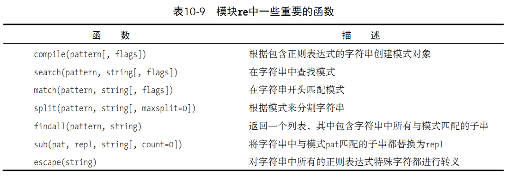

# python基础知识复习

python常用知识点复习

## 数字与序列

### 数据类型

* 数值类型： 整数 分数 浮点数 复数 布尔型 字符串
* 序列类型： 字符串 列表(list) 元组(tuple)
* 映射和集合类型： 字典(dict) 集合(set) 冻结集(frozenset)

#### 数值类型

##### 整数和分数

* 整数默认十进制，可以使用内建函数 `bin` `oct` `hex`将整数转换成二进制、八进制、十六进制的字符串

```python
>>> bin(5) #二进制 0-1
'0b101'
>>> oct(9) #八进制 0-7
'0o11'
>>> hex(23) #十六进制 0-9 a-f(A-F)
'0x17'
```

* 分数 fractions标准库中Fraction类提供分数计算

```python
>>> from fractions import Fraction
>>> x = Fraction(2,5)
>>> y = Fraction(3,7)
>>> x+y
Fraction(29, 35)
>>> x/y
Fraction(14, 15)
>>> x**2
Fraction(4, 25)
>>> y.numerator #分子
3
>>> y.denominator #分母
7
```

* 浮点数转换成分数

```python
>>> x = 2.3
>>> x.as_integer_ratio()
(2589569785738035, 1125899906842624)
```

* 整数型位运算

是对整数在二进制表示下的位进行的运算。主要有以下几种：

1. 按位与（&）：如果两个相应的二进制位都为1，则该位的结果值为1，否则为0。
2. 按位或（|）：两个相应的二进制位中只要有一个为1，该位的结果值为1。
3. 按位异或（^）：两个相应的二进制位值相同则为0，不同则为1。
4. 按位取反（~）：对数据的每个二进制位取反,即把1变为0,把0变为1。
5. 左移（<<）：把<<左边的数据的各二进制位全部左移若干位，右边空出的位用0填充。
6. 右移（>>）：把>>左边的数据的各二进制位全部右移若干位，左边空出位用0的填充或者用符号位填充，具体情况取决于语言规定。

* 码值转换

##### 布尔型

* `bool()` 求布尔值
* 非零数字与非空集合布尔值都是 `True`
* 成员操作符 `in` 返回布尔值
* 布尔类型对象的三个操作符：`and`  `or` `not`

##### 浮点数与复数

* 浮点数64位，52位表示底，11为表示指数，剩下一位表示符号正负
* 复数为两个浮点数组成的有序数对，实部和虚部都是浮点数
* 访问实部、虚部、共轭复数、模
  ```python
  >>> acomplex = 3+4j   
  >>> acomplex.real#实部
  3.0
  >>> acomplex.imag#虚部 
  4.0
  >>> acomplex.conjugate
  <built-in method conjugate of complex object at 0x0000025F75FFA250>
  >>> acomplex.conjugate()#共轭复数
  (3-4j)
  >>> abs(acomplex) #求模
  5.0
  ```
* 浮点数操作函数在math模块中，复数操作的函数在cmath模块中
  ```python
  >>> import math
  >>> import cmath
  >>> from cmath import *
  ```

#### 序列类型

任意类型的值作为元素(element)，按照一定顺序组合而成的数据结构

##### 通用操作符

* `对象 [not] in 序列`
* `seq[m:n]`
* `seq1 + seq2`
* `seq1 * 3`  重复操作

##### 内建函数

* `len()`
* `min()` `max()`
* `sum()`
* `sort()`     `zip()`

  ```python
  >>> zip([1,2,3],['a','b','c']) 
  <zip object at 0x000001E4E0533C80>
  ```

  `zip()`函数返回的是一个迭代器，可以通过将其转换为列表来查看其内容

  ```python
  >>> result = list(zip([1,2,3],['a','b','c']))
  >>> result
  [(1, 'a'), (2, 'b'), (3, 'c')]
  ```

  将两个列表 `[1,2,3]`和 `['a','b','c']`压缩成一个列表，其中每个元素都是一个元组
* `reversed()` 倒序函数  `enumerate()`枚举函数

  `enumerate()`函数将一个可遍历的数据对象（如列表、元组或字符串）组合为一个索引序列，同时列出数据和数据下标

  ```
  >>> for i, value in enumerate(['a', 'b', 'c']):
  ...     print(i, value)
  ...
  0 a
  1 b
  2 c
  ```

##### 字符串

* 赋值

  ```python
  >>> str1 = 'dasf' 
  >>> str2 = '1564 s' 
  >>> x = str1[0] 
  >>> x
  'd'
  >>> str1 + str2 #拼接
  'dasf1564 s'
  >>> str1 * 3
  'dasfdasfdasf'
  >>> str1[0] = 'd' #error 字符串内容不可修改
  Traceback (most recent call last):
    File "<stdin>", line 1, in <module>
  TypeError: 'str' object does not support item assignment
  ```
* 操作
  格式化输出字符串

  ```python
  >>> print('The total is %0.2f' %56.432141) 
  The total is 56.43
  ```

  常见的格式说明符有以下几种：

  * `%s`：字符串。使用str()将任何Python对象转换为字符串。
  * `%d`：整数。十进制整数。
  * `%f`：浮点数。默认保留6位小数，可以通过 `.2f`这样的形式控制小数位数。
  * `%x`：十六进制数。使用小写字母。
  * `%X`：十六进制数。使用大写字母。
  * `%e`：科学计数法表示的浮点数，使用小写的'e'。
  * `%E`：科学计数法表示的浮点数，使用大写的'E'。
  * `%g`：根据值的大小决定使用%f或%e。
  * `%G`：类似%g，但使用大写字母。

##### 列表

列表（list）是一种有序的集合，可以随时添加和删除其中的元素

1. 添加元素，`append()`末尾追加元素 `insert()`在指定位置插入元素

   ```python
   my_list.append('d')
   my_list.insert(1, 'inserted') #insert(插入索引位置， 插入元素)
   ```

   合并列表,会修改原列表

   ```python
   list1 = [1, 2, 3]
   list2 = [4, 5, 6]
   list1.extend(list2)
   print(list1)  # 输出：[1, 2, 3, 4, 5, 6]
   ```
2. 删除元素，`del` `pop()` 或者 `remove()`

   ```python
   del my_list[0]
   my_list.pop()
   my_list.remove('b')
   ```
3. 列表切片访问
4. 列表循环
5. 列表推导式：简洁的方法创建列表

   `squares = [x**2 for x in range(10)]`
6. 列表排序

   ```python
   my_list.sort()
   new_list = sorted(my_list)
   ```

##### 元组

元组（tuple）是一种有序的不可变序列，一旦创建就不能修改，是一种只读的数据结构

1. 创建元组：使用圆括号 `()`来创建元组，元素之间用逗号 `,`分隔

   1. 创建只包含一个元素的元组，你需要在元素后面添加一个逗号 `,`。这是因为括号 `()`可以用于定义元组，也可以用于改变运算的优先级
2. 访问元组元素：通过索引来访问元组中的元素，索引从0开始
3. 不可变性：元组是不可变的，这意味着你不能在元组中添加、删除或修改元素

   元组中的元素如果是可变的（如列表），那么你可以修改这个元素

   ```
   >>> h = (5, [1,5], ('saf', 45, 4))
   >>> h[1][1] = 6
   >>> h
   (5, [1, 6], ('saf', 45, 4))
   ```
4. 元组切片：可以使用切片来访问元组的一部分
5. 可以使用for循环来遍历元组中的每一个元素
6. 元组解包：如果你有一个包含多个元素的元组，你可以在一行中将这些元素赋值给多个变量

   ```python
   >>> x,y,z = (1, 3, 53)  
   >>> x
   1
   >>> y
   3
   >>> z
   53
   ```
7. 元组和函数：元组经常用于Python函数的返回值，因为函数可以返回一个元组，从而一次返回多个值

   ```python
   def min_max(items):
       return min(items), max(items)

   print(min_max([1, 2, 3, 4, 5]))  # 输出：(1, 5)
   ```
8. 可哈希，可以作为字典的键key

### 练习

#### 数学运算

运算符： `//` 向下取整  `%` 取模

使用cmath中的函数计算复数1+2j的正弦值（sin）和极坐标表示(polar)

```python
import cmath

z = 1 + 2j
sin_z = cmath.sin(z)
print(f"The sin of {z} is {sin_z}")

#极坐标转换表示
r,theta = cmath.polar(z)
print (f"The polar coordinates of {z} are (r={r}, theta={theta})")
print (f"The polar coordinates of {z} are ({r:.2f},{theta:.2f})")
```

在Python的格式化字符串（f-string）中，`{r:.2f}`表示将变量 `r`格式化为浮点数，并保留两位小数。

在 `{r:.2f}`中，`:`是格式说明符的开始，`.2f`是格式说明符，表示浮点数格式并保留两位小数

```python
The sin of (1+2j) is (3.165778513216168+1.959601041421606j)
The polar coordinates of (1+2j) are (r=2.23606797749979, theta=1.1071487177940904)
The polar coordinates of (1+2j) are (2.24,1.11)
```

使用数学函数factorial计算70的阶乘

```python
from math import factorial
factorial(70)

import math
math.factorial(70)
```

#### 字符串使用

#### 列表使用

```python
a_list = [1,2,3,4,5]
alist = list(range(1,6))
blst = [1, 'a', 3.6, 2+5j]
```

```python
>>> alist + blst
[1, 2, 3, 4, 5, 1, 'a', 3.6, (2+5j)]
>>> blst * 3
[1, 'a', 3.6, (2+5j), 1, 'a', 3.6, (2+5j), 1, 'a', 3.6, (2+5j)]
```

##### 列表模拟堆栈

堆栈，stack,后进先出

可以把堆栈想象成一摞盘子，新加入的盘子放在最上面，而移除盘子时也只能从最上面开始移除

```python
alst = [1,2,3,4,5]

#入栈
alst.append(6)

#出栈
alst.pop(-1)
```

##### 列表模拟队列

队列,queue,先进先出

可以把队列想象成一排等待付款的人，新来的人站在队伍的最后，而每次只有排在最前面的人可以离开

```python
alst = [1,2,3,4,5]

#入队
alst.append(6)

#出队
alst.pop(0) #移除第一个元素，相当于队列开头元素
```

或者使用 `collections`模块中的 `deque`（双端队列）来实现队列

```python
from collections import deque

# 创建一个空队列
queue = deque()

# 入队操作
queue.append('a')
queue.append('b')
queue.append('c')

print(queue)  # 输出：deque(['a', 'b', 'c'])

# 出队操作
item = queue.popleft()
print(item)  # 输出：'a'
print(queue)  # 输出：deque(['b', 'c'])
```

## 流程控制、字典与集合

### 条件语句

* `if...else` `if...elif...`语句
* 布尔表达式 -- 逻辑操作符 `and` `or` `not`

### 循环语句

* `while` 循环
* `for` 循环，遍历序列元素

### 控制流程

* `continue` 跳过循环剩余语句，继续下一轮循环
* `break` 终止循环语句
* `pass` 什么都不做
* `match-case` (python 3.10,不做要求)

### 字典

#### 赋值

```python
a = {}; a = dict() #定义空字典
b = {'x':3, 'y':4}
c = dict(uid=105, login='Lumberjack', name='Michael Palin')
```

#### 操作

* 根据索引读取 `u = c['uid']`
* 重定义 `c['shell'] = '/bin/sh'`
* 拷贝 `Copy = c.copy()`
* 清空字典 `c.clear()`
* 合并操作 `|`（py3.9 不做要求）

### 集合

#### 赋值

* 定义可变集合 `aset = {1,2,3}`  `bset = set([2,5,8])` `cset = set('anc')`

  ```python
  >>> cset
  {'c', 'n', 'a'}
  ```
* 定义冻结结合，可哈希 `dset = frozenset('abc')`

#### 操作

* 集合没有顺序索引  `aset[0]`这种操作不存在
* `1 in aset`       `in`
* 添加元素  `aset.add(4)`
* 去除元素 `aset.remove(3)`
* 集合交集 `aset & bset`  `&`
* 集合并集 `aset | bset`  `|`   返回aset类型，aset为可变集合或者冻结集合
* 集合差集 `aset - bset` 在a不在b中的元素
* 集合对称差 `aset ^ bset`  两集合并集与交集的差集

## 文件读写

文件对象，既可以是普通磁盘文件也可以是抽象文件：如内存区域、网页等

### 文件对象

#### 创建方法

`file_object = open(file_name, access_mode = 'r', buffering = -1)`

access_mode: 'r' 读		'w' 写	'a' 追加	'+' 可读可写 	'b' 二进制

buffering:访问文件的缓冲方式

* 0，不缓冲
* 1，缓冲一行
* n,缓冲n行
* 负值，系统默认的缓冲模式

#### 操作方法

```python
#输入
read(size)
readline(size)
readlines()

for eachline in file:
    print (eachline)


#输出,写入文件
write(astr)
writelines(str_list)
```

### 标准文件

`import sys`

`sys`模块提供了对一些用于与Python解释器交互的变量和函数的访问

1. `sys.argv`：这是一个列表，包含了从命令行传递给Python脚本的参数。`sys.argv[0]`是脚本的名称。
2. `sys.exit()`：这个函数可以使你的脚本退出，可选地向调用者返回一个状态码。
3. `sys.path`：这是一个字符串列表，包含了Python解释器查找模块的路径。你可以修改这个列表来影响模块的查找和加载。
4. `sys.stdin`、`sys.stdout`和 `sys.stderr`：这些是标准的输入、输出和错误流的文件对象。你可以重定向这些流，或者向它们写入或读取数据。
5. `sys.getsizeof(object)`：返回对象的大小（以字节为单位）。
6. `sys.version`：这是一个字符串，包含了当前Python解释器的版本信息。

### 文件系统访问

`import os`

### 练习：统计DNA核苷酸频率

```python
A_num = C_num = G_num = T_num = 0

for i in range(len(DNAstr)):
    if DNAstr[i]=='A':
        A_num = A_num + 1
    elif DNAstr[i]=='C':
        C_num = C_num + 1
    elif DNAstr[i]=='G':
        G_num += 1 #another way
    elif DNAstr[i]=='T':
        T_num += 1 #another way
  
print("A_num =", A_num)
print("C_num =", C_num)
print("G_num =", G_num)
print("T_num =", T_num)

total_num = len(DNAstr)
print("A_frq =", A_num/total_num)
print("C_frq =", C_num/total_num)
print("G_frq =", G_num/total_num)
print("T_frq =", T_num/total_num)

dna_dic = {'A': 0, 'C': 0, 'G': 0, 'T': 0} #the dict for DNA numbers
for n in DNAstr:
    dna_dic[n] += 1
print(dna_dic) #print out the DNA numbers in a dict format

dna_frq_dic = {}
DNAs = 'ACGT' #the 4 kinds of nucleiotides
for d in DNAs: #calculate the frequencies
    dna_frq_dic[d] = dna_dic[d]/total_num
print(dna_frq_dic) #print out the DNA frequencies in a dict format

output_file_name = 'D:/frq.txt'
output_file = open(output_file_name, 'wt') #open file in a writing and text model
output_string = '\t'.join(DNAs)
output_file.write(output_string + '\n')
output_string = ''
for d in DNAs:
    output_string += str(dna_dic[d]) + '\t'
output_string = output_string.strip()
output_string += '\n'
output_file.write(output_string)
olst = [] #create a list for DNA frequencies
for d in DNAs:
    olst.append(str(dna_frq_dic[d]))
output_string = '\t'.join(olst) + '\n'
output_file.write(output_string)
output_file.close() #please check the file D:\frq.txt to see what you got
```

### with语句读取DNA序列

* with语句和文件上下文管理器（file context manager）读写文件
* f-string格式化浮点数（频率）输出

```python
#This is a demo script for "with" and "file" context manager.

with open('DNAseq.txt','rt') as ifl:
    DNAstr = ifl.read()

DNAlen = len(DNAstr) - 1

A_frq = DNAstr.count('A')/DNAlen
C_frq = DNAstr.count('C')/DNAlen
G_frq = DNAstr.count('G')/DNAlen
T_frq = DNAstr.count('T')/DNAlen

print('A_frq =', A_frq)
print('C_frq =', C_frq)
print('G_frq =', G_frq)
print('T_frq =', T_frq)

with open('DNAfrq.txt', 'wt') as ofl:
    ofl.write('\t'.join(['A', 'C', 'G', 'T'])+'\n')
    #using f-string to format output
    ofl.write(f'{A_frq: .3f}\t{C_frq: .3f}\t{G_frq: .3f}\t{T_frq: .3f}\n')

print('done! (^_^)')


```

### 文件操作

1. 序列每十个字符放在一行输出至文件中

   ```
   pass
   ```
2. 将生成文件每行拆分成一个文件，以数字命名

   ```
   pass
   ```
3. 将拆分的文件合并

## 函数定义

pass

## 面对对象编程(OOP)

一切皆对象，每个对象有属性（数据）、方法（行为）

三个核心概念：封装、继承、多态

1. 封装：封装是将对象的状态（属性）和行为（方法）包装在一起的过程。这可以隐藏对象的内部实现细节，并防止外部代码直接访问对象的内部数据。
2. 继承：继承是一种使得一个类（子类）可以使用另一个类（父类）的属性和方法的机制。子类可以继承父类的属性和方法，也可以添加新的属性和方法，或者覆盖父类的属性和方法。
3. 多态：多态是指允许一个接口（父类或者接口）有多种实现形式（子类的实现）。在运行时，可以根据实际类型来执行相应的方法，这使得我们可以在设计更高层的代码时，只需要关心接口而不是具体的类。

### 类定义、封装与组合

#### 定义

类定义需要指定构造方法 __init__()

```python
class Dog:
    def __init__(self):
        self.mouth = "big"
    def bark(self):
        print("Woof!")
```

* 执行 wangcai =Dog() 时实际上是执行了 Dog.__init__(wangcai) 这个方法(函数)
* 无法通过类名直接调用实例方法,如 `Dog.bark()`  错误的

  ```
  >>> wangcai = Dog()
  >>> wangcai.bark()
  Woof!
  >>> Dog.bark()
  Traceback (most recent call last):
    File "<stdin>", line 1, in <module>
  TypeError: Dog.bark() missing 1 required positional argument: 'self'
  >>> Dog.bark(wangcai)#传递一个实例作为参数
  Woof!
  ```
* 类定义中可选定义 析构方法,当一个对象即将被系统回收时，`__del__()`方法会被自动调用

  ```python
  class Dog:
      def __init__(self):
          self.mouth = "big"

      def bark(self):
          print("Woof!")

      def __del__(self):
          print("A dog object has been deleted.")
  ```

  当 `Dog`类的一个实例被删除时，`__del__()`方法会被调用，输出："A dog object has been deleted."

##### 练习

```python
>>> print(Dog.mouth) 
Traceback (most recent call last):
  File "<stdin>", line 1, in <module>
AttributeError: type object 'Dog' has no attribute 'mouth'
>>> print(wangcai.mouth) 
big
>>> print(Dog.bark)  
<function Dog.bark at 0x000002644983EE60>
>>> print(wangcai.bark) 
<bound method Dog.bark of <__main__.Dog object at 0x000002644981B130>>
```

1. `print(Dog.mouth)`：试图访问类 `Dog`的属性 `mouth`，但是 `mouth`是定义在 `Dog`类的实例上的，而不是类本身，所以会报 `AttributeError`。
2. `print(wangcai.mouth)`：访问的是 `Dog`类的一个实例 `wangcai`的 `mouth`属性，这是正确的。
3. `print(Dog.bark)`：访问的是类 `Dog`的方法 `bark`，它返回的是一个函数对象，所以你看到的是一个函数的内存地址。
4. `print(wangcai.bark)`：访问的是 `Dog`类的一个实例 `wangcai`的 `bark`方法，它返回的是一个绑定方法对象，这个方法已经绑定到了实例 `wangcai`上。

##### 类的属性

访问一个属性时，Python首先会在实例的属性中查找，如果找不到，就会去类的属性中查找

```python
class Dog:
    jaw = ["sharp", 32]
    paw = ["cute", 4]
    def __init__(self):
        self.mouth = "big"
  
print(Dog.jaw)
xiaobai = Dog()
print(xiaobai.paw)
```

特殊属性和方法

* `Dog.__doc__`:类的文档字符串
* `Dog.__dict__`: 类的所有属性
* `Dog.__module__`: 类所在模块
* `Dog.__class__`: 所属的类型
* 
* `xiaohei.__sizeof__()`: 对象内存大小  实例方法

  ```python
  >>> print(Dog.__doc__)
  None
  >>> print(Dog.__class__) 
  <class 'type'>
  >>> print(Dog.__dict__)  
  {'__module__': '__main__', 'jaw': ['sharp', 32], 'paw': ['cute', 4], '__init__': <function Dog.__init__ at 0x000002644983F010>, '__dict__': <attribute '__dict__' of 'Dog' objects>, '__weakref__': <attribute '__weakref__' of 'Dog' objects>, '__doc__': None}
  ```

##### 类的方法

方法定义中不用self

可以通过类直接调用，也可以通过实例调用

###### 静态方法

在Python中，静态方法是一种特殊的方法，可以使用 `@staticmethod`装饰器或 `staticmethod()`函数将一个方法定义为静态方法

```python
class example:
    def foo():
        print("This is a static method.")  
    foo = staticmethod(foo)
```

```python
class example:
    @staticmethod
    def foo():
        print("This is a static method."）
```

###### 类方法

`classmethod()`

###### 函数修饰符@

`@staticmethod`      `@classmethod`      如上

##### 型与类

```python
class Dog:
    head = 1
    tail = 3
  
    @classmethod
    def show_head(cls):
            print('The head is ', cls.head)
    #show_head = classmethod(show_head)
  
    @staticmethod
    def show_tail():
            print('The tail is', Dog.tail)
    #show_tail = staticmethod(show_tail)
  
    def __init__(self):
        self.jaw = 'strong'
  
    def show_jaw(self):
        print('The jaw is', self.jaw)

    def show_head_2(self): 
        print('The head is', Dog.head) 
  
    @classmethod 
    def show_jaw_2(cls):
        print('The jaw is', self.jaw) 

    @staticmethod 
    def show_jaw_3():
        print('The jaw is', self.jaw)


Dog.show_head() 
Dog.show_tail() 
Dog.show_jaw()  
Dog.show_jaw_2()
Dog.show_jaw_3()

adog = Dog() 
adog.show_head() 
adog.show_head_2() 
adog.show_tail() 
adog.show_jaw() 
```

### 继承、多态

#### 继承

定义子类

`super()`函数是用来调用父类（超类）的一个方法，即可以在不关心对象具体类型的情况下编写代码，只需要关心对象是否有你需要的方法或属性

#### 多态

多态是指不同的对象可以响应相同的方法调用

Python中，可以在两个不相干的类中定义同样的方法接口，从而实现多态

## 动态语法、异常处理

### 求值函数eval()

* `eval("{}.fromkeys(range(2))")`：计算表达式 `{}.fromkeys(range(2))`，输出结果为 `{0: None, 1: None}`，这是一个字典，它的键是 `range(2)`生成的数字，值都是 `None`。
* `eval("list(map(lambda x: x**2, range(3)))")`：计算表达式 `list(map(lambda x: x**2, range(3)))`，输出结果为 `[0, 1, 4]`，这是一个列表，它的元素是 `range(3)`生成的数字的平方。
* `eval("[pow(i,0.5) for i in range(3)]")`：计算表达式 `[pow(i,0.5) for i in range(3)]`，输出结果为 `[0.0, 1.0, 1.4142135623730951]`，这是一个列表，它的元素是 `range(3)`生成的数字的平方根。
* `eval("(abs(x) for x in [-1,2,-3,4])").__next__()`：计算表达式 `(abs(x) for x in [-1,2,-3,4])`，这是一个生成器，它的元素是列表 `[-1,2,-3,4]`的元素的绝对值。`__next__()`方法获取生成器的下一个元素，输出结果为1。
* `astr = "x**y"; a_scope = {'x': 3, 'y': 4}; eval(astr, a_scope)`：计算表达式 `x**y`，在这个表达式中，`x`和 `y`的值是在 `a_scope`字典中定义的。输出结果为81，这是3的4次方。

### 执行函数exec()

`exec(source, [globals, [locals]])`函数可以执行以字符串形式或代码对象给定的Python语句，表达式需要是语句

```python
>>> exec("print({}.fromkeys(range(2)))") #输出{0: None, 1: None}
>>> exec("f = lambda x: x**2"); f(3)
9
>>> exec("def func(x): return x**2"); func(3)
9
>>> astr = "print(x**y)"
>>> a_scope = {'x': 3, 'y': 4}
>>> exec(astr, a_scope)
81
```

### 代码对象

`compile(source, filename, mode, […])`

* `source`：要编译的源代码。它可以是一个字符串，也可以是一个AST对象。
* `filename`：源代码的文件名。如果源代码没有来自文件，你可以传递一些可以识别源代码的字符串。
* `mode`：指定编译代码的模式。它必须是 `'exec'`、`'eval'`或 `'single'`之一。需要搭配 `eval()` `exec()`函数使用
  * `'exec'`：如果源代码由一系列语句组成，python模块或者文件
  * `'eval'`：源代码由一个表达式组成
  * `'single'`：源代码由单个交互式语句组成

```python
>>> eval_code = compile( '3+4', '', 'eval') #可求值表达式
>>> eval_code
<code object <module> at 0000000002C59630, file "", line 1>
>>> eval(eval_code)
7
>>> callable(eval_code) #code对象可执行，但不可调用
False
>>> single_code = compile("print('hello world!')",'','single')
>>> exec(single_code)
hello world!
```

```python
>>> exec_code = compile('', '', 'exec')
#三引号（'''或"""）定义多行字符
>>> exec_code = compile('''n = 
input('Count how many numbers?')
for i in range(int(n)):
print(i)
''', '', 'exec')
>>> exec(exec_code)
Count how many numbers?5
0
1
2
3
4
```

### 异常处理

异常是一个事件，表示在程序执行过程中发生了错误。当Python解释器遇到错误时，它会引发一个异常。如果这个异常没有被捕获和处理，程序就会终止。

可以使用 `try/except`语句来捕获和处理异常。`try`块包含可能引发异常的代码，`except`块包含处理异常的代码。例如：

```python
try:
    x = 1 / 0  # 这将引发一个ZeroDivisionError
except ZeroDivisionError:
    print("You can't divide by zero!")
```

可以使用 `raise`语句来引发一个异常。可以引发一个内置的异常，也可以定义一个新的异常类并引发它

```python
class MyException(Exception):
    pass

try:
    raise MyException("This is a custom exception")
except MyException as e:
    print(e)
```

`MyException`是一个新的异常类，它继承自内置的 `Exception`类。`raise`语句引发了一个 `MyException`实例，然后 `except`块捕获了这个异常并打印了它的消息。

```python
#You may copy this line into the console.
ProSeq = 'MNAPERQPQPDGBBGDAPGHEPGGSPQDELDFSILFDYEYLNPNEEEPNAHKVASPPSOOGPAYPDDVLDYGLKPYSPLASLSGEPPGRFGEPDBRVGPQKFLSAAKPAGASGLSPRIEITPSHELIQAVGPLRMRDAGLLVEQPPLAGVAASPRFTLPVPGFEGYREPLCLSPAXSSGSSASFISDTFSPYTSPCVSPNNGGPUDDLCPQFQNIPAHYSPRTSPIMSPRTSLAEDSCLGRHSPVPRPASRSSSPGAXXXKRRHSCAEALVALPPGASPQRSRSPSPQPSSHVAPQDHGSPAGYPPVAGSAVIMDALNSLATDXSPCGIPPKMWKTXSP'

#The 20 normal amino acids
AA20 = 'ACDEFGHIKLMNPQRSTVWY'

#### The dict for amino acid numbers ####
aa_dic = {}
for a in AA20:
    aa_dic[a] = 0

#### The try-except clauses ####
for a in ProSeq:
    try:
        aa_dic[a] += 1
    except KeyError: # or # except:
        print('Find an abnormal amino acid:', a)


print(aa_dic)
```

## 泛函编程、迭代器、生成器

### 泛函编程

泛函编程是一种编程范式，强调使用函数和避免改变状态。在Python中，你可以使用高阶函数（如 `map()`、`filter()`和 `reduce()`），以及lambda函数来进行泛函编程。例如：

```python
# 使用map和lambda函数来对列表中的每个元素加1
nums = [1, 2, 3, 4, 5]
nums_plus_one = map(lambda x: x + 1, nums)
print(list(nums_plus_one))  # 输出 [2, 3, 4, 5, 6]
```

### 迭代器、生成器

**迭代器** ：迭代器是一个可以记住遍历的位置的对象。迭代器对象必须实现两个方法，`__iter__()`和 `__next__()`。

```python
class TestIterator:
	value = 0
	def __next__(self):
		self.value += 1
		if self.value > 10: 
			raise StopIteration
			return self.value
	def __iter__(self):
		return self
ti = TestIterator()
list(ti)#[1, 2, 3, 4, 5, 6, 7, 8, 9, 10]
```


可以使用 `next()`函数来获取迭代器的下一个元素。例如：

__`__next__()`__

```python
>>> a = eval("(abs(x) for x in [-1,2,-3,4])")  
>>> a.__next__()
1
>>> a.__next__()
2
```

**生成器** ：生成器是一种特殊的迭代器，可以使用 `yield`语句来生成值。生成器是一种惰性计算的方式，只有在需要下一个值时才会计算。

```python
>>> nested = [[1,2], [3,4], [5]]
>>> def flatten(nested):
	for sublist in nested:
		for element in sublist:
			yield element
			#print(element)
>>> for num in flatten(nested): #逐行输出各个数字
	print(num)
>>> list(flatten(nested)) #返回数字列表 [1, 2, 3, 4, 5]
```

## 模块与程序库

在Python中，模块和包是用来组织代码的两种主要方式。

**模块** ：模块是一个包含Python代码的.py文件。你可以在一个模块中定义函数、类和变量，然后在其他模块中使用 `import`语句来导入这个模块，使用这些函数、类和变量。例如，如果你有一个名为 `mymodule.py`的文件，你可以使用 `import mymodule`来导入这个模块。

**包** ：包是一个包含多个模块的目录，这个目录必须包含一个 `__init__.py`文件（在Python 3.3及以后的版本中，这个文件可以为空）。你可以使用 `.`来导入包中的模块。例如，如果你有一个名为 `mypackage`的包，这个包中有一个名为 `mymodule`的模块，你可以使用 `import mypackage.mymodule`来导入这个模块。

    ➢`__init__.py`文件中的内容，主要是定义一些全局对象（包括变量、函数、类等），检测系统的运行环境，包括操作系统环境和Python安装程序的版本等信息。
	➢ __init__.py文件在包被第一次导入时，会被编译成.pyc文件；之后，若无改动，则不再编译，否则，		重新编译。

    使用模块和包可以帮助你组织代码，使代码更易于理解和维护。你可以将相关的代码放在同一个模块中，将相关的模块放在同一个包中。

### 模块

模块的搜索路径可以通过sys.path列表进行查看和修改

```python
>>> import sys
>>> print(sys.path)
['', 'E:\\coding\\Miniforge3\\envs\\dzx\\python310.zip', 'E:\\coding\\Miniforge3\\envs\\dzx\\DLLs', 'E:\\coding\\Miniforge3\\envs\\dzx\\lib', 'E:\\coding\\Miniforge3\\envs\\dzx', 'E:\\coding\\Miniforge3\\envs\\dzx\\lib\\site-packages', 'E:\\coding\\Miniforge3\\envs\\dzx\\lib\\site-packages\\win32', 'E:\\coding\\Miniforge3\\envs\\dzx\\lib\\site-packages\\win32\\lib', 'E:\\coding\\Miniforge3\\envs\\dzx\\lib\\site-packages\\Pythonwin']
```

可以使用 `sys.path.append("path")`增加模块的搜索路径

### 包 package

程序包，简称“包”，是以文件系统的目录形式组织的***模块的集合***。模块文件所在的目录就是包，前提是包含初始化文件，即名为 `__init__.py`的文件。

### 程序包分类

* Python自带的程序包，也叫标准库（Standard Library），在Python的安装目录下，模块文件分于libs、Lib目录及其子目录中。
* 第三方写的程序包，即，别人写的、用户可以拿来用的程序包，一般存放在：Python安装目录/Lib/site-packages目录下。
* 用户自己写的程序包，一般放在当前目录下，或用户目录下，或其他搜索路径可以找到的目录下，比如，Python安装目录/Lib/site-packages目录下。

### 练习

#### time模块

#### random模块

## 正则表达式

`re`模块提供了正则表达式匹配操作，正则表达式是一种强大的字符串处理工具，可以用来进行字符串的匹配、替换和分割等操作。

以下是 `re`模块的一些主要函数：

<div align=center></div>

* `re.match(pattern, string)`：从字符串的开始位置匹配模式，如果在开始位置匹配成功，返回一个匹配对象，否则返回None。
* `re.search(pattern, string)`：搜索整个字符串，找到第一个匹配的位置，返回一个匹配对象，如果没有找到匹配，返回None。
* `re.findall(pattern, string)`：返回一个列表，包含字符串中所有匹配的子串。
* `re.sub(pattern, repl, string)`：将字符串中匹配模式的部分替换为repl，返回替换后的字符串。

  ```python
  import re

  # 匹配字符串中的数字
  result = re.findall(r'\d+', 'hello 123 world 456')
  print(result)  # 输出 ['123', '456']

  # 替换字符串中的数字为'num'
  result = re.sub(r'\d+', 'num', 'hello 123 world 456')
  print(result)  # 输出 'hello num world num'
  ```

  ```python
  from re import *

  some_text = "alpha.beta....gamma delta"

  pat = compile('.a')
  match(pat, some_text)

  >>> print(match(pat, some_text)) 
  None
  ```

  ```python
  >>> result = search(pat, some_text)
  >>> print(result)
  <re.Match object; span=(3, 5), match='ha'>
  >>> result.group()
  'ha'
  ```

  ```python
  >>> split(compile('a.'), some_text)
  ['', 'ph', 'bet', '...g', 'm', 'delta']
  >>> split(compile('a .'), some_text)
  ['alpha.beta....gamm', 'elta']

  >>> sub(pat, 'b', some_text)
  'alpb.beb....bmb delb'
  ```

### 模式匹配符

* `.`：匹配任何字符（除了换行符）。
* `^`：匹配字符串的开始。
* `$`：匹配字符串的结束。
* `*`：匹配前面的子表达式零次或多次。
* `+`：匹配前面的子表达式一次或多次。
* `?`：匹配前面的子表达式零次或一次。
* `{n}`：匹配前面的子表达式n次。
* `{n,}`：匹配前面的子表达式n次或更多次。
* `{n,m}`：匹配前面的子表达式至少n次，但不超过m次。

### 类别匹配符

`\d`：匹配任何数字，等价于 `[0-9]`。

`\D`：匹配任何非数字字符，等价于 `[^0-9]`。

`\s`：匹配任何空白字符，等价于 `[\t\n\r\f\v]`。

`\S`：匹配任何非空白字符，等价于 `[^\t\n\r\f\v]`。

`\w`：匹配任何字母数字字符，等价于 `[a-zA-Z0-9_]`。

`\W`：匹配任何非字母数字字符，等价于 `[^a-zA-Z0-9_]`。

## Biopython使用实例

### Bio.Seq

```python
#从Biopython中引入序列类
from Bio.Seq import Seq

#生成一个含有A、C、G、T的字符串
astr = 'ATGAAACGCATTAGCACCACCATTACCACCACCATCACCATTACCACAGGTAACGGTGCGGGCTGA'

#生成一条DNA序列，即，Seq类的一个实例
dna_seq = Seq(astr)

#查看序列对象
dna_seq
print(dna_seq)

#查看DNA序列的第一个字符、最后一个字符、前10个字符
dna_seq[0]
dna_seq[-1]
print(dna_seq[:10])

#把DNA序列当成普通字符串，用循环依次输出其字符
for a in dna_seq:
    print(a)

#查看DNA序列对象的属性和方法
dir(dna_seq)

#计算DNA序列中G的含量
G_num = dna_seq.count('G')
print('G content is :', G_num/len(dna_seq))

  
#得到DNA序列的互补序列
c_dna_seq = dna_seq.complement()
c_dna_seq

#得到DNA序列的反向互补序列
rc_dna_seq = dna_seq.reverse_complement()
rc_dna_seq

#调用转录方法，得到RNA序列
rna_seq = dna_seq.transcribe()
rna_seq

#调用翻译方法，得到Protein序列
pro_seq = dna_seq.translate()
pro_seq

#计算蛋白序列中氨基酸T出现的次数
pro_seq.count('T')

#查看蛋白序列对象的属性和方法
dir(pro_seq)

```

### PDB模块

```python
from Bio.PDB import *
#查看当前环境中定义了哪些变量、函数和类
dir()

pdbflname = 'pdb4xb7.ent'

#调用PDBParser()类，创建一个PDBParser对象，解析PDB文件
parser = PDBParser()
struct = parser.get_structure('s1', pdbflname)

for model in struct.get_iterator():
   for chain in model.get_iterator():
       for chain in model.get_iterator():
           for residue in chain.get_iterator():
               for atom in residue.get_iterator():
                   print(atom)
           
atomcord = [0, 0, 0]; atomnum = 0

for model in struct.get_iterator():
   for chain in model.get_iterator():
       for chain in model.get_iterator():
           for residue in chain.get_iterator():
               for atom in residue.get_iterator():
                    atomcord[0] += atom.get_coord()[0]
                    atomcord[1] += atom.get_coord()[1]
                    atomcord[2] += atom.get_coord()[2] 
                    atomnum += 1
                           
geomcenter = (atomcord[0]/atomnum, atomcord[1]/atomnum, atomcord[2]/atomnum)

print('geometric center is:', geomcenter)
```

