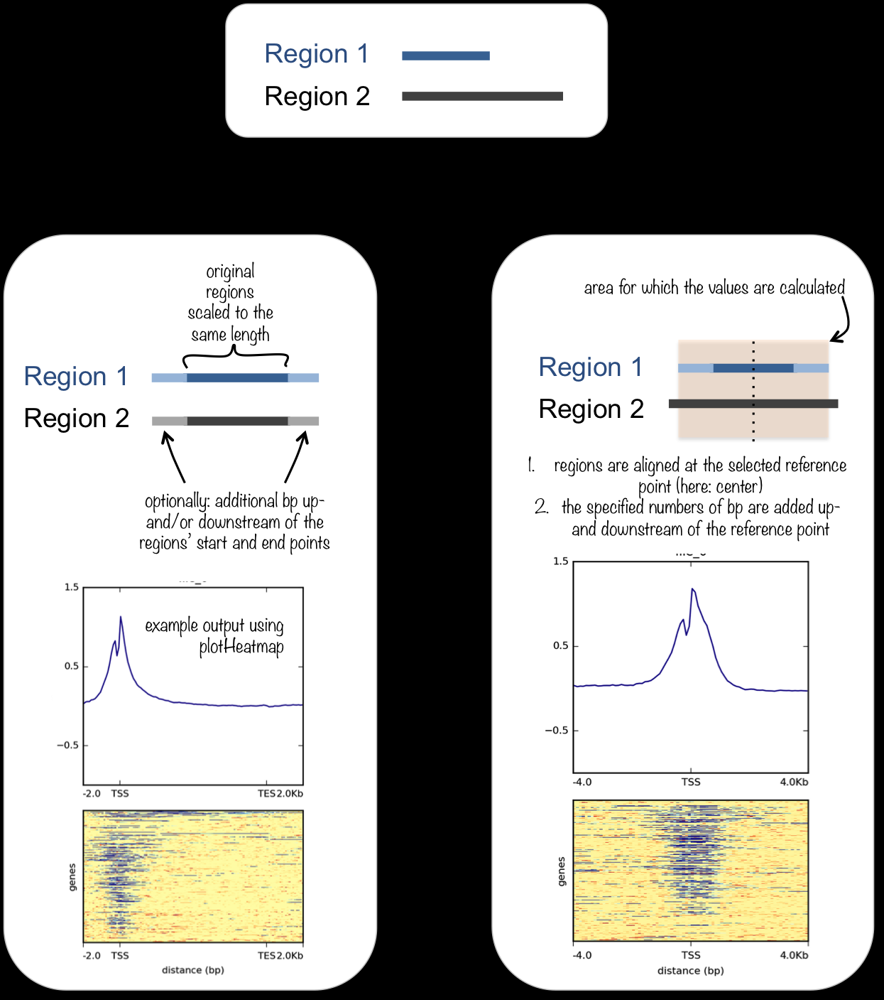

# R包peak注释

利用ChIPseeker R包对peak进行注释

经过前期的处理拿到了BED文件，利用这些文件和ChIPSeeker可以进一步对peak注释、可视化。

## 指定Bioregion结合图谱可视化

网上大部分教程都是限定一个固定的窗口(比如最常用到的TSS启动子区域)，将所有的peak全部align(标准化对齐？)，可视化其结合谱图。而我想要的效果是 将**整个基因(从TSS上游限定部分至TTS下游限定部分)**作为一个窗口

类似效果如下图左侧的`original regions scaled to the same length`

解决时间顺序记录链接

[could the &#34;plotAvgProf&#34; can get the region from TSS to TTS ? · Issue #87 · YuLab-SMU/ChIPseeker · GitHub](https://github.com/YuLab-SMU/ChIPseeker/issues/87)

[增加明立-929分箱生物区图绘制功能 ·拉取请求 #156 ·YuLab-SMU/ChIPseeker ·GitHub](https://github.com/YuLab-SMU/ChIPseeker/pull/156)

[ChIPseeker: an R package for ChIP peak Annotation, Comparison and Visualization (bioconductor.org)](https://bioconductor.org/packages/devel/bioc/vignettes/ChIPseeker/inst/doc/ChIPseeker.html#profile-of-chip-peaks-binding-to-tts-regions)

## 其他常规可视化

[CS6: ChIP数据可视化 (guangchuangyu.github.io)](https://guangchuangyu.github.io/2017/10/chipseeker-visualization/)

## 参考

[CS6: ChIP数据可视化 (guangchuangyu.github.io)](https://guangchuangyu.github.io/2017/10/chipseeker-visualization/)

[CS4：关于ChIPseq注释的几个问题 (qq.com)](https://mp.weixin.qq.com/s?__biz=MzI5NjUyNzkxMg==&mid=2247484084&idx=1&sn=b3fb1b88a9f73e26278688dfbce60679&chksm=ec43b3f3db343ae5ea5a657b22bd0ed427c928f75c45484badaf6a6714777d8239cb0b1997b5#rd)

