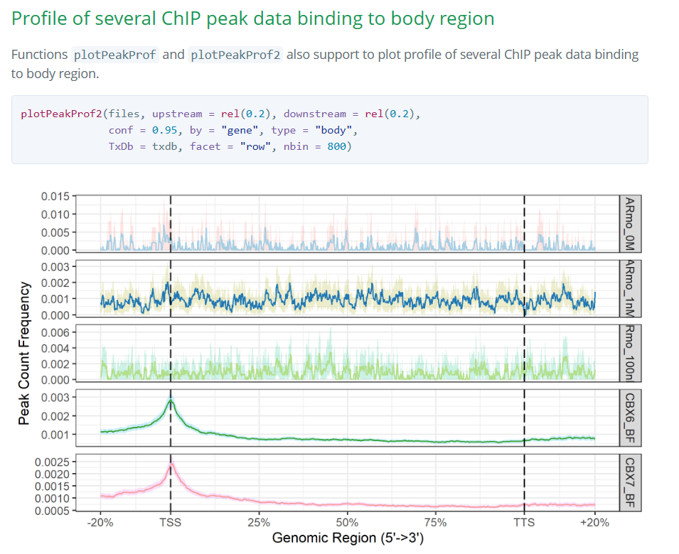

# R包peak注释

利用ChIPseeker R包对peak进行注释

经过前期的处理拿到了BED文件，利用这些文件和ChIPSeeker可以进一步对peak注释、可视化。

## 指定Bioregion结合图谱可视化

网上大部分教程都是限定一个固定的窗口(比如最常用到的TSS启动子区域)，将所有的peak全部align(标准化对齐？)，可视化其结合谱图。而我想要的效果是 将**整个基因(从TSS上游限定部分至TTS下游限定部分)**作为一个窗口

类似效果如下图左侧的 `original regions scaled to the same length`


经过一系列bing搜索找到了这个问题的解决顺寻：

[could the &#34;plotAvgProf&#34; can get the region from TSS to TTS ? · Issue #87 · YuLab-SMU/ChIPseeker · GitHu](https://github.com/YuLab-SMU/ChIPseeker/issues/87)

[Adding function of plotting bioregion by binning by MingLi-929 · Pull Request #156 · YuLab-SMU/ChIPseeker (github.com)](https://github.com/YuLab-SMU/ChIPseeker/pull/156)


在这个界面中，作者借鉴deeptools中computeMatrix的分bin方法归一化不同BioRegion的长度，加入了一系列函数实现上述设想目的。

但是实践后发现在最新的包里面似乎没有了这些函数，最后在bioconductor中找到一些详细的示例说明，发现函数名称功能重整。

[ChIPseeker: an R package for ChIP peak Annotation, Comparison and Visualization (bioconductor.org)](https://bioconductor.org/packages/devel/bioc/vignettes/ChIPseeker/inst/doc/ChIPseeker.html#profile-of-chip-peaks-binding-to-tts-regions)



plotPeakProf2，可以直接输入*summits.bed文件名（路径），通过指定 `type = "body"`将txdb文件中每一条序列的整个特定BioRegion作为一个窗口。

## 实践流程 & 代码

导入相关的包

```R
library(ChIPseeker)
#install.packages("RMariaDB")
library(RMariaDB)
library(GenomicFeatures)
library(ggimage)
```

获取背景注释信息

**GenomicFeatures**包中有函数用来制作TxDb对象：

* makeTxDbFromUCSC： 通过UCSC在线制作TxDb
* makeTxDbFromBiomart: 通过ensembl在线制作TxDb
* makeTxDbFromGRanges：通过GRanges对象制作TxDb
* makeTxDbFromGFF：通过解析GFF文件制作TxDb

通过ucsc或者ensembl数据库ftp协议下载gff文件，如 ftp://ftp.ebi.ac.uk/pub/databases/pombase/pombe/Chromosome_Dumps/gff3/schiz

```R
maize_TxDb <- makeTxDbFromGFF("E:/seq_project/work_data/Zma_B73_V4.gff3")
```

整段peak注释画图代码

```R
bed_data_path <- "E:/seq_project/work_data/summits_bed"
orgs <- c("ear_1", "ear_2", "shoot_1", "shoot_2", "tassel")
plot_path <- "E:/seq_project/R包peak注释/plot"

for (org in orgs){
    bed_files <- list.files(paste(bed_data_path, org, sep = "/"), pattern = "\\.bed$", full.names = TRUE)
    bed_names <- gsub("_summits.*", "", basename(bed_files))
    names(bed_files) <- bed_names
    bed_files <- as.list(bed_files)
    #依次读取bed文件
    for (bed_file in bed_files){
        peak <- readPeakFile(bed_file)
        peakAnno <- annotatePeak(peak, tssRegion=c(-2000, 2000), TxDb=maize_TxDb) 
        pdf(file = file.path(plot_path,"pie", org, paste(basename(bed_file), "_pie", ".pdf", sep = "")))
        plotAnnoPie(peakAnno)
        dev.off()

        pdf(file = file.path(plot_path,"pie", org, paste(basename(bed_file), "_upset", ".pdf", sep = "")))
        p <- upsetplot(peakAnno, vennpie=TRUE)
        print(p)
        dev.off()   
    }
    pdf(file = file.path(plot_path,"PeakProf", paste0(org, "genebody_PeakProf", ".pdf")))
    p_1 <- plotPeakProf2(bed_files, upstream = 1000, downstream = 1000,
    conf = 0.95, by = "gene", type = "body", nbin = 800,
    TxDb = maize_TxDb, facet = "row")
    print(p_1)
    dev.off()
}
```

## 其他常规可视化

[CS6: ChIP数据可视化 (guangchuangyu.github.io)](https://guangchuangyu.github.io/2017/10/chipseeker-visualization/)

## 参考

[CS6: ChIP数据可视化 (guangchuangyu.github.io)](https://guangchuangyu.github.io/2017/10/chipseeker-visualization/)

[CS4：关于ChIPseq注释的几个问题 (qq.com)](https://mp.weixin.qq.com/s?__biz=MzI5NjUyNzkxMg==&mid=2247484084&idx=1&sn=b3fb1b88a9f73e26278688dfbce60679&chksm=ec43b3f3db343ae5ea5a657b22bd0ed427c928f75c45484badaf6a6714777d8239cb0b1997b5#rd)

[ChIPseeker: an R package for ChIP peak Annotation, Comparison and Visualization (bioconductor.org)](https://bioconductor.org/packages/devel/bioc/vignettes/ChIPseeker/inst/doc/ChIPseeker.html#profile-of-chip-peaks-binding-to-tts-regions)

