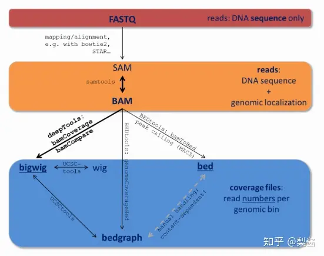
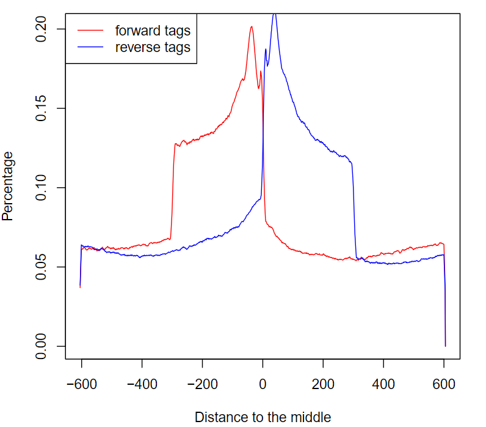
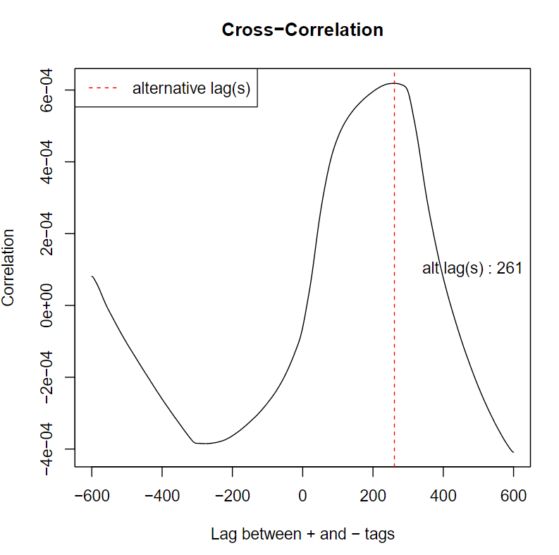
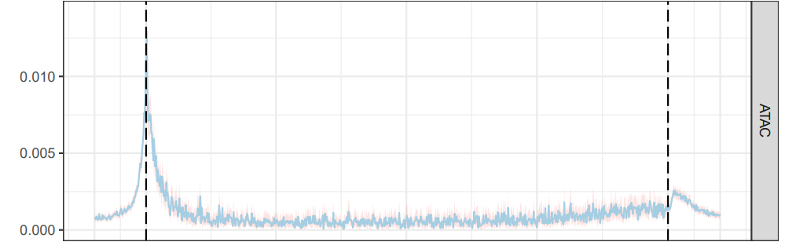
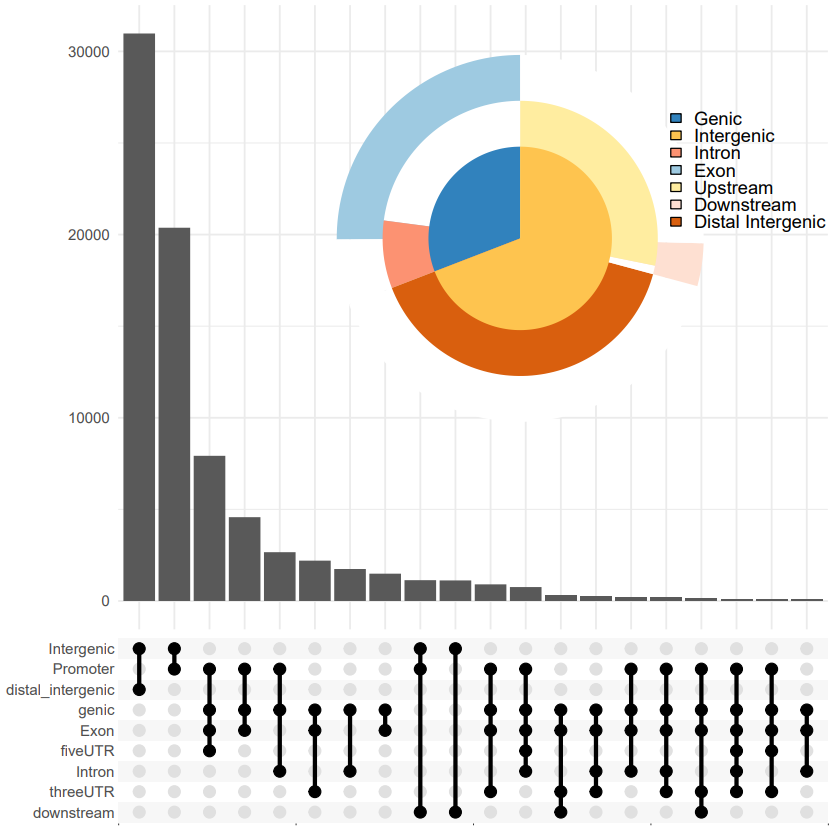
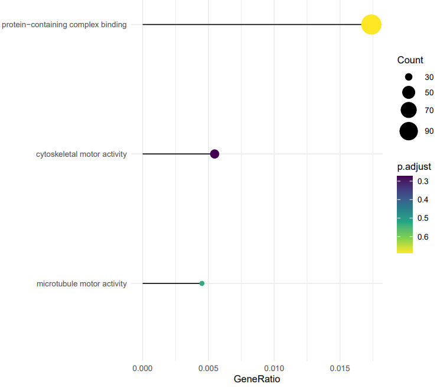

# 生信进展-ATAC数据处理

## 实验材料

[SRR5748809 : Run Browser : SRA Archive : NCBI (nih.gov)](https://trace.ncbi.nlm.nih.gov/Traces/?view=run_browser&acc=SRR5748809&display=analysis)

关于玉米（Zea mays）叶肉细胞（leaf mesophyll）的ATAC-seq数据，用于研究染色质可及性的高通量测序数据

## 实验流程

### 软件

SRA-tools [Index of /sra/sdk (nih.gov)](https://ftp-trace.ncbi.nlm.nih.gov/sra/sdk/)

FastQC [Babraham Bioinformatics - FastQC A Quality Control tool for High Throughput Sequence Data](https://www.bioinformatics.babraham.ac.uk/projects/fastqc/)

BWA [lh3/bwa: Burrow-Wheeler Aligner for short-read alignment (see minimap2 for long-read alignment) (github.com)](https://github.com/lh3/bwa)

samtools [samtools/samtools: Tools (written in C using htslib) for manipulating next-generation sequencing data (github.com)](https://github.com/samtools/samtools)

bedtools [bedtools: a powerful toolset for genome arithmetic — bedtools 2.31.0 documentation](https://bedtools.readthedocs.io/en/latest/index.html)

deeptools [bedtools: a powerful toolset for genome arithmetic — bedtools 2.31.0 documentation](https://bedtools.readthedocs.io/en/latest/index.html)

R-clusterPro [Bioconductor - clusterProfiler](https://bioconductor.org/packages/release/bioc/html/clusterProfiler.html)


### 分析步骤

#### 数据预处理

通过itc平台使用逸夫楼网络环境ssh登录

```shell
ssh bio_zxdai@172.16.192.8
```

将所需要软件路径加入环境变量

```shell
cat >> .bashrc << EOF
> PATH=/home/software/sratoolkit.3.1.0-centos_linux64/bin/:$PATH
> EOF
```

或者将上述若干命令写入脚本，将执行脚本命令加入 `.bashrc`文件

```shell
[bio_zxdai@bioinfo-01 ~]$ cat /home/software/softlist
PATH=/home/software/bwa-0.7.17:$PATH
PATH=/home/software/FastQC:$PATH
PATH=/home/software/fastp:$PATH
PATH=/home/software/bowtie2-2.4.5-linux-x86_64:$PATH
PATH=/home/software/hisat2-2.1.0:$PATH
PATH=/home/software/tophat-2.1.1.Linux_x86_64:$PATH
PATH=/home/software/bedtools2/bin:$PATH
PATH=/home/software/samtools-1.9:$PATH
PATH=/home/software/subread-2.0.3-Linux-x86_64/bin:$PATH
PATH=/home/software/stringtie-2.2.1.Linux_x86_64:$PATH

PATH=/home/software/miniconda3/bin:$PATH
# alias samtools="samtools_0.1.18"

PATH=/home/software/BatMeth2-master/bin:$PATH
alias Trimmomatic="java -jar /home/software/Trimmomatic-0.39/trimmomatic-0.39.jar"

PATH=/home/software/STAR-master/source/:$PATH
PATH=/home/software/qualimap_v2.2.1/:$PATH
#PATH=/home/software/bowtie-1.3.1/:$PATH
PATH=/Bioinfo/zxzhu/software/BatMeth2/bin:$PATH
```

```shell
cat >> .bashrc << EOF
> source /home/software/softlist
> EOF
```

使用NCBI的sratoolkit下载sra数据

prefetch命令下载

```shell
prefetch SRR5748809
```

fastq-dump 工具对 SRA 文件进行 fastq 文件切分

```shell
[bio_zxdai@bioinfo-01 data]$ fasterq-dump --split-3 SRR5748809 -O fastq
spots read      : 10,480,210
reads read      : 20,960,420
reads written   : 20,960,420
```

fastqc质量控制

```shell
fastqc -o ./qc -t 4 -f fastq ./data/fastq/*
```

序列剪切（Trimmomatic）

创建Trimmomatic命令别名

```shell
alias Trimmomatic="java -jar /home/software/Trimmomatic-0.39/trimmomatic-0.39.jar"
```

添加adapter文件

```shell
cp /home/software/Trimmomatic-0.39/adapters/* ./
cat NexteraPE-PE.fa - TruSeq3-PE-2.fa >> adapters.fa
```

单端测序数据剪切

```shell
Trimmomatic SE -phred33 -threads 3 /Bioinfo/bio_2023_2024_2/bio_zxdai/ATAC-seq/data/fastq/SRR5748809.fastq SRR5748809_processed.fastq ILLUMINACLIP:./adapters/adapters.fa:2:30:10 LEADING:3 TRAILING:3 SLIDINGWINDOW:4:20 MINLEN:36 -trimlog log.txt
```

命令参数解释

* `SE`：表示这是单端（Single End）测序数据。如果是双端（Paired End）测序数据，这里应该使用 `PE`。
* `-phred33`：指定质量分数的编码方式。Phred33是最常见的编码方式，用于Illumina数据和较新的Sanger数据。
* `-threads 3`：指定使用3个线程进行并行处理。
* `/Bioinfo/bio_2023_2024_2/bio_zxdai/ATAC-seq/data/fastq/SRR5748809.fastq`：输入文件的路径，这是需要进行质量控制的原始测序数据。
* `SRR5748809_processed.fastq`：输出文件的路径，这是经过质量控制后的测序数据。
* `ILLUMINACLIP:./adapters/adapters.fa:2:30:10`：使用IlluminaClip步骤移除测序适配器。`./adapters/adapters.fa`是适配器序列的文件路径，`2:30:10`是这个步骤的参数，分别表示种子匹配长度、回报和回报字符串匹配度。
* `LEADING:3`：移除读取开始部分质量低于3的碱基。
* `TRAILING:3`：移除读取结束部分质量低于3的碱基。
* `SLIDINGWINDOW:4:20`：使用滑动窗口剪切，当窗口内的平均质量低于20时剪切。窗口大小为4。
* `MINLEN:36`：移除长度低于36的读取。
* `-trimlog log.txt`：记录每个读取的剪切信息，输出到 `log.txt`文件。

#### 序列比对

agstat.txt

参考基因组下载

```shell
wget --quiet  -c https://download.maizegdb.org/Zm-B73-REFERENCE-NAM-5.0/Zm-B73-REFERENCE-NAM-5.0.fa.gz
#解压压缩文件
gunzip *gz
```

检查基因组下载是否完整

使用 `md5sum`命令来检查文件的完整性。这个命令会计算文件的MD5哈希值，可以将这个值与你从下载页面得到的MD5哈希值进行比较

```shell
md5sum Zm-B73-REFERENCE-NAM-5.0.fa
```

BWA建立索引、匹配

```shell
#建立索引
nohup bwa index ./ref/Zm*.fa & 
#cd回上一级路径
cd ..
```

使用 `bwa index` 建立索引，索引文件会以 `Zm*.fa`所匹配到的表达式为文件名前缀

```shell
#align
#mem algorithm
bwa mem ./data/ref/Zm-B73-REFERENCE-NAM-5.0.fa ./data/fastq/SRR5748809.fastq 1>./align/SRR5748809.sam 2>./align/bwa_mem.log &

#ALN algorithm
bwa aln -t 5 ./data/ref/Zm-B73-REFERENCE-NAM-5.0.fa ./data/fastq/SRR5748809.fastq 1>./align/SRR5748809.sai 2>./align/bwa_aln.log &
bwa samse ./data/ref/Zm-B73-REFERENCE-NAM-5.0.fa ./align/SRR5748809.sai ./data/fastq/SRR5748809.fastq 1>./align/SRR5748809.aln.sam &
```

`bwa mem`是BWA的默认算法，适用于长度70bp-1Mbp的序列。它比 `bwa aln`更快，更准确，尤其是对于较长的序列。`bwa mem`也支持gapped alignment（允许插入和删除），并且可以处理paired-end reads

* `-t 多线程并行`
* `1>./align/SRR5748809.sam`:  将标准输出（对齐结果）重定向到SAM文件。
* `2>./align/bwa_mem.log`:  将标准错误输出（如错误和警告信息）重定向到日志文件。

`bwa aln`是BWA的旧算法，适用于长度up to ~100bp的序列。它使用回溯法（backtracking）进行比对，对于较短的序列效果较好。然而，`bwa aln`不支持gapped alignment，因此对于包含插入和删除的序列，其比对效果可能不如 `bwa mem`。推荐使用 `bwa mem`

aln算法会先生成 `.sai` BWA-backtrack算法的对齐结果文件,然后使用 `bwa samse`--BWA的一个模块，将BWA-backtrack算法的对齐结果转换为SAM格式

比对结果的统计

```shell
echo $! > bwa.pid
wait $(cat bwa.pid) && samtools view -bS ./align/SRR5748809.sam | samtools flagstat - > ./align/flagstat.txt
```

将测序数据比对回基因组需要花费一定时间，可以使用上述命令或者写成一个脚本以连贯执行命令

* `-b`: samtools将输出转换为BAM格式
* `-S`: 指定samtools输入文件SAM格式
* `-`: 表示从标准输入（stdin）读取数据，数据来自于前一个命令的输出

#### Peak calling

筛选比对结果

```shell
sample="SRR5748809"
#去除PCR重复
$picard MarkDuplicates -I ../align/${sample}.bam 
    -O${sample}.rmdup.bam -M ${sample}.rmdup.metric --REMOVE_DUPLICATES true

#去除低质量reads(-q 30)以及未必对到同一条染色体(-f 2)的数据
$samtools view -h -f 2 -q 30 ${sample}.rmdup.bam | grep -v chrM | $samtools sort -O bam -@ 20 -o - >${sample}.last.bam
bedtools bamtobed -i ${sample}.last.bam >${sample}.bed
```

call peak

```shell
mkdir peaks 
macs2 callpeak -t ./align/*bed -g 14300719022 --nomodel --shift -100 --extsize 200 -n SRR5748809 --outdir ./peaks
```

参数的解析：

- `-t`：指定处理组的文件，这里是 BED 格式的文件
- `-g`：指定基因组的大小
- `--nomodel`：这个选项告诉 MACS2 不要构建移位模型，这对于 ATAC-seq 数据是必要的，因为 ATAC-seq 数据的片段大小不代表转录因子结合位点。
- `--shift`：移动读取的中心位置。对于 ATAC-seq 数据，通常会设置为 -100，表示向 5' 方向移动 100 bp
- `--extsize`：设置读取的延伸大小。对于 ATAC-seq 数据，通常会设置为 200，表示每个读取都会向 3' 方向延伸 200 bp

```text
INFO  @ Thu, 28 Mar 2024 15:32:03: #1 tag size is determined as 51 bps 
INFO  @ Thu, 28 Mar 2024 15:32:03: #1 tag size = 51.0 
INFO  @ Thu, 28 Mar 2024 15:32:03: #1  total tags in treatment: 27376162 
INFO  @ Thu, 28 Mar 2024 15:32:03: #1 user defined the maximum tags... 
INFO  @ Thu, 28 Mar 2024 15:32:03: #1 filter out redundant tags at the same location and the same strand by allowing at most 1 tag(s) 
INFO  @ Thu, 28 Mar 2024 15:32:03: #1  tags after filtering in treatment: 15521232 
INFO  @ Thu, 28 Mar 2024 15:32:03: #1  Redundant rate of treatment: 0.43 
INFO  @ Thu, 28 Mar 2024 15:32:03: #1 finished! 
INFO  @ Thu, 28 Mar 2024 15:32:03: #2 Build Peak Model... 
INFO  @ Thu, 28 Mar 2024 15:32:03: #2 Skipped... 
INFO  @ Thu, 28 Mar 2024 15:32:03: #2 Use 200 as fragment length 
INFO  @ Thu, 28 Mar 2024 15:32:03: #2 Sequencing ends will be shifted towards 5' by 100 bp(s) 
INFO  @ Thu, 28 Mar 2024 15:32:03: #3 Call peaks... 
INFO  @ Thu, 28 Mar 2024 15:32:03: #3 Pre-compute pvalue-qvalue table... 
INFO  @ Thu, 28 Mar 2024 15:33:16: #3 Call peaks for each chromosome... 
INFO  @ Thu, 28 Mar 2024 15:33:56: #4 Write output xls file... SRR5748809_peaks.xls 
INFO  @ Thu, 28 Mar 2024 15:33:56: #4 Write peak in narrowPeak format file... SRR5748809_peaks.narrowPeak 
INFO  @ Thu, 28 Mar 2024 15:33:57: #4 Write summits bed file... SRR5748809_summits.bed 
INFO  @ Thu, 28 Mar 2024 15:33:57: Done! 
```

不使用nomodel参数可以获得model_plot.r，用于绘制片段大小的分布图，反映了开放染色质的区域

#### 生成bw/bigwig文件



通过路径 bam -> bedGraph -> bigwig/bw

获取 `chrom.sizes` 文件，其中包含了每个染色体的名称和大小

```shell
samtools faidx data/ref/*fa
cut -f1,2 data/ref/*.fa.fai > data/ref/chrom.sizes
```

```shell
bedtools genomecov -bg -i peaks/*summits.bed -g data/ref/chrom.sizes > peaks/SRR5748809.bedGraph
bedGraphToBigWig peaks/SRR5748809.bedGraph data/ref/chrom.sizes peaks/SRR5748809.bw
```

```shell
[bio_zxdai@bioinfo-01 ATAC-seq]$ ll peaks
total 12524
-rw-rw-r--. 1 bio_zxdai bio_zxdai 1288417 Apr  8 15:22 SRR5748809.bedGraph
-rw-rw-r--. 1 bio_zxdai bio_zxdai  559174 Apr  8 15:22 SRR5748809.bw
-rw-rw-r--. 1 bio_zxdai bio_zxdai   25600 Apr  8 14:33 SRR5748809_model.pdf
-rw-rw-r--. 1 bio_zxdai bio_zxdai   99228 Mar 28 15:47 SRR5748809_model.r
-rw-rw-r--. 1 bio_zxdai bio_zxdai 3919519 Mar 28 15:49 SRR5748809_peaks.narrowPeak
-rw-rw-r--. 1 bio_zxdai bio_zxdai 4257998 Mar 28 15:49 SRR5748809_peaks.xls
-rw-rw-r--. 1 bio_zxdai bio_zxdai 2660699 Mar 28 15:49 SRR5748809_summits.bed
```

上游分析结束

#### 下游分析

##### Peak注释

只考虑玉米染色体1-10

```R
#BiocManager::install("GenomicFeatures")
#BiocManager::install("ChIPseeker")
install.packages("ggupset")
library(ChIPseeker)
#install.packages("RMariaDB")
library(RMariaDB)
library(GenomicFeatures)
library(ggimage)
library(tidyverse)
maize_TxDb <- makeTxDbFromGFF("D:/seq_project/seq_project/work_data/Zma_B73_V4.gff3")

wd <- "F:/course/生物信息学进展/ATAC-seq/ATAC"
setwd(wd)
tissue <- "Zea_mays"

bed_file <- file.path(wd, "SRR5748809_summits.bed")
bed_name <- gsub("_summits.*", "", basename(bed_file))
names(bed_file) <- bed_name

bed <- read.table(bed_file, header = FALSE, stringsAsFactors = FALSE)

bed <- subset(bed, bed$V1 %in% paste0("chr", 1:10)) %>%
        mutate(V1 = gsub("chr", "", V1)) 
write.table(bed, file = file.path(wd, paste0(bed_name, ".bed")), sep = "\t", quote = FALSE, row.names = FALSE, col.names = FALSE)
bed_file <- file.path(wd, paste0(bed_name, ".bed"))

peak <- readPeakFile(file.path(wd, paste0(bed_name, ".bed")))
# # 将染色体名称的格式改为 "chr" 开头
# seqlevelsStyle(maize_TxDb) <- "UCSC"
# # 检查改变后的染色体名称
# seqlevels(maize_TxDb)s
peakAnno <- annotatePeak(peak, tssRegion=c(-1000, 1000), TxDb=maize_TxDb)
pdf(file = file.path(wd, paste(basename(bed_file), "_pie", ".pdf", sep = "")))
plotAnnoPie(peakAnno)
dev.off()

pdf(file = file.path(wd, paste(basename(bed_file), "_upset", ".pdf", sep = "")))
p <- upsetplot(peakAnno, vennpie=TRUE)
print(p)
dev.off()

pdf(file = file.path(wd, paste0("genebody_PeakProf", ".pdf")))
p_1 <- plotPeakProf2(bed_file, upstream = 1000, downstream = 1000,
        conf = 0.95, by = "gene", type = "body", nbin = 800,
        TxDb = maize_TxDb, facet = "row")
print(p_1)
dev.off()
```

TSS/gene body 位点peak plot展示

deeptools

```shell
computeMatrix scale-regions -p 12 \
      -S ./peaks/SRR5748809.bw \
      -R ./peaks/SRR5748809_summits.bed \
      -b 100000 -a 100000 \
      -o ./plot/SRR5748809.gz \
      --binSize 10 --missingDataAsZero \
      --skipZeros \
      --outFileNameMatrix ./plot/SRR5748809_matrix.tab

plotHeatmap -m ./plot/SRR5748809.gz \
      -out ./plot/SRR5748809.pdf \
      --dpi 300 \
      --colorMap YlGnBu  \
      --missingDataColor "#FFF6EB"\
      --heatmapHeight 21 \
      --startLabel "TSS" \
      --endLabel "TTS" \
      --regionsLabel "gene" \
      --legendLocation "none" \
      --plotTitle "Zea mays"
```


##### 峰基因GO富集分析

Gene Ontology

使用 `ChIPseeker`包将峰值注释到最近的基因，GO富集分析

```R
peakAnno <- annotatePeak(peak, tssRegion=c(-1000, 1000), TxDb=maize_TxDb)

#annotated peaks to gene and clusterProfiler
library(clusterProfiler)
library(AnnotationHub)

hub <- AnnotationHub()
maize <- hub[["AH114308"]]
entrez_gene_id <- read.csv("D:/motif_project/16.tss_maxmotif_GO/data/entrez_Zm_gene_v4.csv", header = T)
gene_ids <- unique(as.data.frame(peakAnno)$geneId) %>% as.data.frame()
colnames(gene_ids) <- "geneId"
genes <- merge(gene_ids, entrez_gene_id, by.x = "geneId", by.y = "gene_name", all.x = T) %>%
        na.omit()


ego <- enrichGO(gene         = genes$ENTREZID,
                OrgDb        = maize, 
                keyType      = "ENTREZID", 
                pAdjustMethod = "BH", 
                pvalueCutoff = 0.8, 
                qvalueCutoff = 1,
                readable     = TRUE) 

head(ego)
write.table(ego, file = file.path(wd, paste0(basename(bed_file), "_GO.tsv")), sep = "\t", quote = FALSE, row.names = FALSE)

pdf(file = file.path(wd, paste0(basename(bed_file), "_GO_barplot.pdf")))
dotp <- ggplot(ego, 
        aes(GeneRatio, fct_reorder(Description, GeneRatio))) + 
        geom_segment(aes(xend=0, yend = Description)) +
        geom_point(aes(color=p.adjust, size = Count)) +
        scale_color_viridis_c(guide=guide_colorbar(reverse=TRUE)) +
        scale_size_continuous(range=c(2, 10)) +
        theme_minimal() + 
        ylab(NULL)
print(dotp) 
dev.off()
```

## 实验结果

### 数据预处理

原始SRR5748809 QC


使用上述Trimmomatic命令剪切后，质量没有之前好


其中per base sequence content有些许改变，似乎可以通过 `HEADCROP:14`参数删除前14个碱基，但序列本身不是很长，便没有尝试


### 序列比对

[序列比对数据结果](/2024_spring_ATAC/flagstat.txt)

```shell
[bio_zxdai@bioinfo-01 align]$ cat flagstat.txt
27933221 + 0 in total (QC-passed reads + QC-failed reads)
0 + 0 secondary
34 + 0 supplementary
0 + 0 duplicates
27376162 + 0 mapped (98.01% : N/A)
0 + 0 paired in sequencing
0 + 0 read1
0 + 0 read2
0 + 0 properly paired (N/A : N/A)
0 + 0 with itself and mate mapped
0 + 0 singletons (N/A : N/A)
0 + 0 with mate mapped to a different chr
0 + 0 with mate mapped to a different chr (mapQ>=5)
```

### peak calling

peak calling结果分析

```shell
INFO  @ Thu, 28 Mar 2024 15:32:03: #1 tag size is determined as 51 bps 
INFO  @ Thu, 28 Mar 2024 15:32:03: #1 tag size = 51.0 
INFO  @ Thu, 28 Mar 2024 15:32:03: #1  total tags in treatment: 27376162 
INFO  @ Thu, 28 Mar 2024 15:32:03: #1 user defined the maximum tags... 
INFO  @ Thu, 28 Mar 2024 15:32:03: #1 filter out redundant tags at the same location and the same strand by allowing at most 1 tag(s) 
INFO  @ Thu, 28 Mar 2024 15:32:03: #1  tags after filtering in treatment: 15521232 
INFO  @ Thu, 28 Mar 2024 15:32:03: #1  Redundant rate of treatment: 0.43 
INFO  @ Thu, 28 Mar 2024 15:32:03: #1 finished! 
INFO  @ Thu, 28 Mar 2024 15:32:03: #2 Build Peak Model... 
INFO  @ Thu, 28 Mar 2024 15:32:03: #2 Skipped... 
INFO  @ Thu, 28 Mar 2024 15:32:03: #2 Use 200 as fragment length 
INFO  @ Thu, 28 Mar 2024 15:32:03: #2 Sequencing ends will be shifted towards 5' by 100 bp(s) 
INFO  @ Thu, 28 Mar 2024 15:32:03: #3 Call peaks... 
INFO  @ Thu, 28 Mar 2024 15:32:03: #3 Pre-compute pvalue-qvalue table... 
INFO  @ Thu, 28 Mar 2024 15:33:16: #3 Call peaks for each chromosome... 
INFO  @ Thu, 28 Mar 2024 15:33:56: #4 Write output xls file... SRR5748809_peaks.xls 
INFO  @ Thu, 28 Mar 2024 15:33:56: #4 Write peak in narrowPeak format file... SRR5748809_peaks.narrowPeak 
INFO  @ Thu, 28 Mar 2024 15:33:57: #4 Write summits bed file... SRR5748809_summits.bed 
INFO  @ Thu, 28 Mar 2024 15:33:57: Done! 
```

* `tag size is determined as 51 bps`：reads的大小为51个碱基对
* `filter out redundant tags at the same location and the same strand by allowing at most 1 tag(s)`：同一位置和同一链上的冗余标签被过滤掉
* `tags after filtering in treatment: 15521232`：过滤后，处理的样本中有15521232个tags
* `Redundant rate of treatment: 0.43`：处理的样本中的冗余率为0.43

[SRR5748809_model.pdf](/2024_spring_ATAC/SRR5748809_model.pdf)

反映了开放染色质的区域，这个图显示出多个峰值，这些峰值对应于不同的核小体状态



交叉相关性（Cross-correlation）图，x轴代表着滞后（lag），也就是读取的移位量，y轴代表着交叉相关性，也就是在给定的滞后下，正向和反向读取的相关性，峰值的位置表示了最佳的滞后，也就是最佳的片段大小

只有一个明显的峰值，这表示大部分的读取都集中在结合位点附近



### 下游分析





GO富集分析



## 实验总结

原始测序数据不错，使用FastQC质量控制查看一下，保证

1. 序列质量合格
2. 没有过表达的primer adaptor
3. 序列长度不是很短 即可

序列比对数据结果分析

* `27933221 + 0 in total (QC-passed reads + QC-failed reads)`: 总共有27933221个reads，其中没有QC失败的reads。测序数据的质量应该是相当好的
* `0 + 0 secondary`: 没有secondary（次要的）对齐，这些通常是由于reads可以对齐到多个位置。
* `34 + 0 supplementary`: 有34个补充的对齐，这些通常是由于reads可以对齐到多个位置。
* `27376162 + 0 mapped (98.01% : N/A)`: 有27376162个reads被映射到参考序列，占总reads的98.01%。非常高的映射率，说明大部分reads都能找到参考序列上的对应位置
* `0 + 0 paired in sequencing`、`0 + 0 read1`、`0 + 0 read2`、`0 + 0 properly paired (N/A : N/A)`、`0 + 0 with itself and mate mapped`、`0 + 0 singletons (N/A : N/A)`、`0 + 0 with mate mapped to a different chr`、`0 + 0 with mate mapped to a different chr (mapQ>=5)`: 这些统计信息都是关于配对的reads的，但在这个数据集中，所有的reads都是单端的，所以这些统计信息都是0

基因富集分析结论

GO富集分析结果显示了"protein-containing complex binding"、"cytoskeletal motor activity"和"microtubule motor activity"这三个GO项。这可能意味着在叶肉细胞中，有一些基因的调控区域是开放的，这些基因可能参与到蛋白质复合物的结合和细胞骨架的运动中。这些过程可能与叶肉细胞的一些重要功能有关，例如光合作用、物质运输等

1. "protein-containing complex binding"：涉及到的基因编码的蛋白质能够与包含多种蛋白质的复合物结合。这可能意味着ATAC峰值附近基因可能参与到一些需要多种蛋白质共同作用的生物过程中，例如信号转导、基因转录调控等。
2. "cytoskeletal motor activity"和"microtubule motor activity"：这两个GO项都与细胞骨架和微管运动有关，参与到许多重要的细胞过程中，例如细胞分裂、物质运输等。

## 参考

[fasta/fastq格式解读 - 发那个太丢人 - 博客园 (cnblogs.com)](https://www.cnblogs.com/djx571/p/9493934.html)

[生信软件 | Sratools (操作SRA文件)-腾讯云开发者社区-腾讯云 (tencent.com)](https://cloud.tencent.com/developer/article/1772411)

[转录组分析——三、sra转换成fastq - 简书 (jianshu.com)](https://www.jianshu.com/p/bdfa8f7e5a61)

[都8102年了，还用fastq-dump，快换fasterq-dump吧 - 简书 (jianshu.com)](https://www.jianshu.com/p/5c97a34cc1ad)

[转录组之序列剪切（Trimmomatic）[学习笔记通俗易懂版] - 知乎 (zhihu.com)](https://zhuanlan.zhihu.com/p/642000061)

[「与国同庆，万字长文」ATAC-seq实战教程：从SRA数据下载到高分辨率论文主图绘制 - 知乎 (zhihu.com)](https://zhuanlan.zhihu.com/p/415718382)

