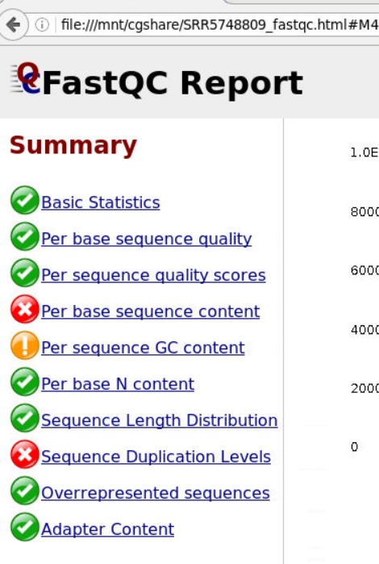
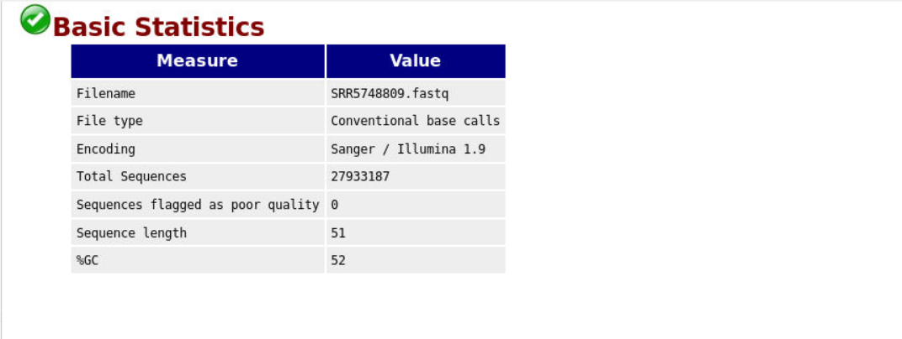
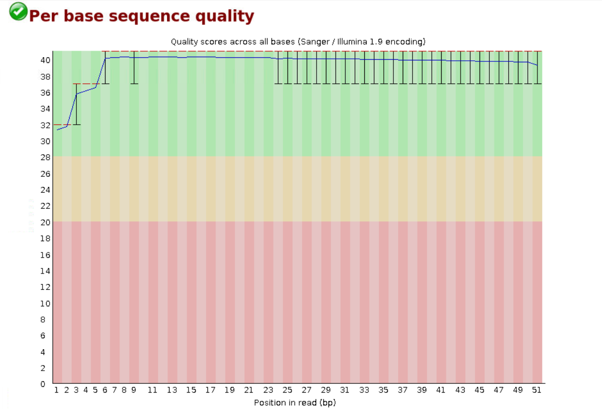
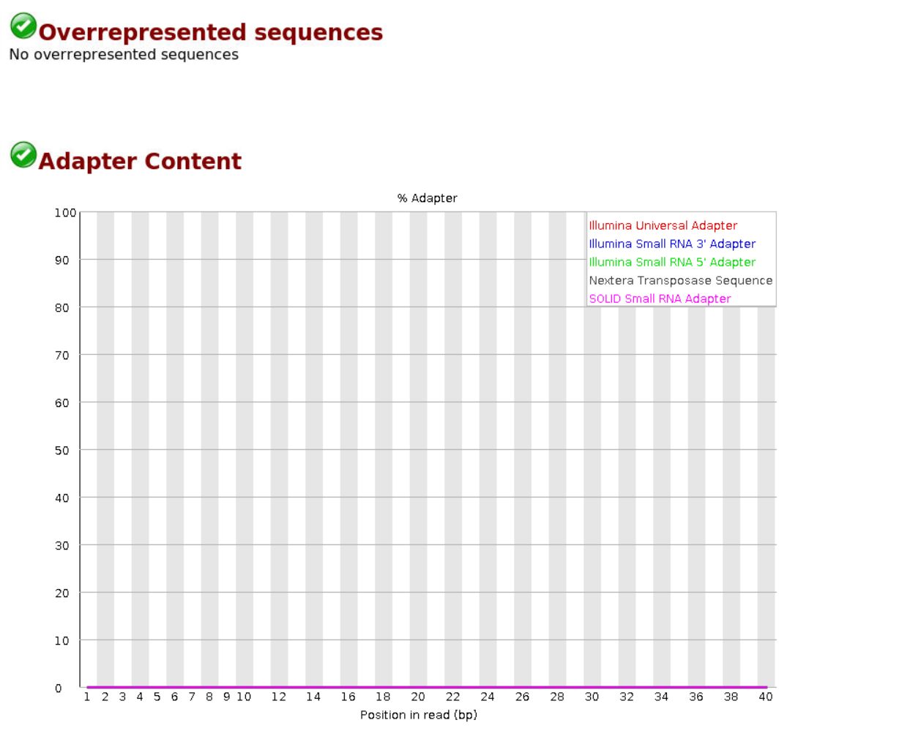
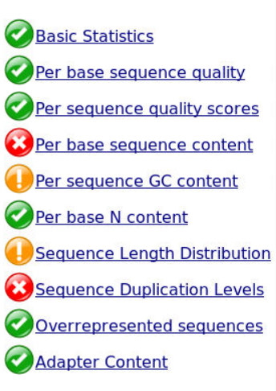
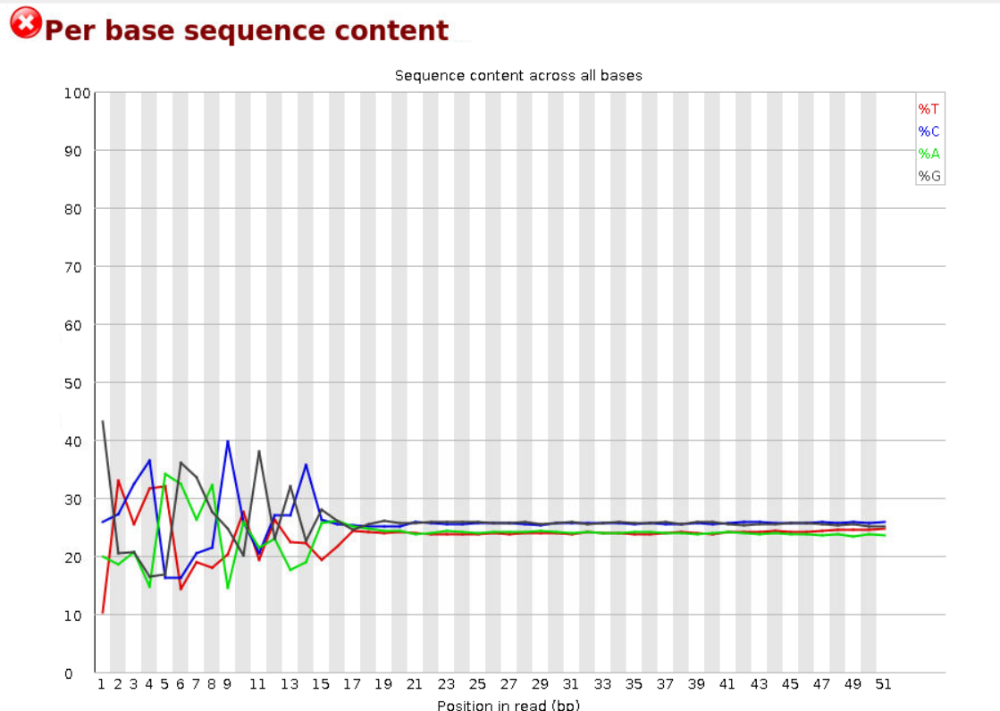

# 生信进展-ATAC数据处理

## 实验材料

[SRR5748809 : Run Browser : SRA Archive : NCBI (nih.gov)](https://trace.ncbi.nlm.nih.gov/Traces/?view=run_browser&acc=SRR5748809&display=analysis)

关于玉米（Zea mays）叶肉细胞（leaf mesophyll）的ATAC-seq数据，用于研究染色质可及性的高通量测序数据

## 实验流程

### 软件：

SRA-tools [Index of /sra/sdk (nih.gov)](https://ftp-trace.ncbi.nlm.nih.gov/sra/sdk/)

FastQC [Babraham Bioinformatics - FastQC A Quality Control tool for High Throughput Sequence Data](https://www.bioinformatics.babraham.ac.uk/projects/fastqc/)

### 分析步骤

#### 数据预处理

通过itc平台使用逸夫楼网络环境ssh登录

```shell
ssh bio_zxdai@172.16.192.8
```

将所需要软件路径加入环境变量

```shell
cat >> .bashrc << EOF
> PATH=/home/software/sratoolkit.3.1.0-centos_linux64/bin/:$PATH
> EOF
```

或者将上述若干命令写入脚本，将执行脚本命令加入 `.bashrc`文件

```shell
[bio_zxdai@bioinfo-01 ~]$ cat /home/software/softlist
PATH=/home/software/bwa-0.7.17:$PATH
PATH=/home/software/FastQC:$PATH
PATH=/home/software/fastp:$PATH
PATH=/home/software/bowtie2-2.4.5-linux-x86_64:$PATH
PATH=/home/software/hisat2-2.1.0:$PATH
PATH=/home/software/tophat-2.1.1.Linux_x86_64:$PATH
PATH=/home/software/bedtools2/bin:$PATH
PATH=/home/software/samtools-1.9:$PATH
PATH=/home/software/subread-2.0.3-Linux-x86_64/bin:$PATH
PATH=/home/software/stringtie-2.2.1.Linux_x86_64:$PATH

PATH=/home/software/miniconda3/bin:$PATH
# alias samtools="samtools_0.1.18"

PATH=/home/software/BatMeth2-master/bin:$PATH
alias Trimmomatic="java -jar /home/software/Trimmomatic-0.39/trimmomatic-0.39.jar"

PATH=/home/software/STAR-master/source/:$PATH
PATH=/home/software/qualimap_v2.2.1/:$PATH
#PATH=/home/software/bowtie-1.3.1/:$PATH
PATH=/Bioinfo/zxzhu/software/BatMeth2/bin:$PATH
```

```shell
cat >> .bashrc << EOF
> source /home/software/softlist
> EOF
```

使用NCBI的sratoolkit下载sra数据

prefetch命令下载

```shell
prefetch SRR5748809
```

fastq-dump 工具对 SRA 文件进行 fastq 文件切分

```shell
[bio_zxdai@bioinfo-01 data]$ fasterq-dump --split-3 SRR5748809 -O fastq
spots read      : 10,480,210
reads read      : 20,960,420
reads written   : 20,960,420
```

fastqc质量控制

```shell
fastqc -o ./qc -t 4 -f fastq ./data/fastq/*
```

序列剪切（Trimmomatic）

创建Trimmomatic命令别名

```shell
alias Trimmomatic="java -jar /home/software/Trimmomatic-0.39/trimmomatic-0.39.jar"
```

添加adapter文件

```shell
cp /home/software/Trimmomatic-0.39/adapters/* ./
cat NexteraPE-PE.fa - TruSeq3-PE-2.fa >> adapters.fa
```

单端测序数据剪切

```shell
Trimmomatic SE -phred33 -threads 3 /Bioinfo/bio_2023_2024_2/bio_zxdai/ATAC-seq/data/fastq/SRR5748809.fastq SRR5748809_processed.fastq ILLUMINACLIP:./adapters/adapters.fa:2:30:10 LEADING:3 TRAILING:3 SLIDINGWINDOW:4:20 MINLEN:36 -trimlog log.txt
```

命令参数解释

* `SE`：表示这是单端（Single End）测序数据。如果是双端（Paired End）测序数据，这里应该使用 `PE`。
* `-phred33`：指定质量分数的编码方式。Phred33是最常见的编码方式，用于Illumina数据和较新的Sanger数据。
* `-threads 3`：指定使用3个线程进行并行处理。
* `/Bioinfo/bio_2023_2024_2/bio_zxdai/ATAC-seq/data/fastq/SRR5748809.fastq`：输入文件的路径，这是需要进行质量控制的原始测序数据。
* `SRR5748809_processed.fastq`：输出文件的路径，这是经过质量控制后的测序数据。
* `ILLUMINACLIP:./adapters/adapters.fa:2:30:10`：使用IlluminaClip步骤移除测序适配器。`./adapters/adapters.fa`是适配器序列的文件路径，`2:30:10`是这个步骤的参数，分别表示种子匹配长度、回报和回报字符串匹配度。
* `LEADING:3`：移除读取开始部分质量低于3的碱基。
* `TRAILING:3`：移除读取结束部分质量低于3的碱基。
* `SLIDINGWINDOW:4:20`：使用滑动窗口剪切，当窗口内的平均质量低于20时剪切。窗口大小为4。
* `MINLEN:36`：移除长度低于36的读取。
* `-trimlog log.txt`：记录每个读取的剪切信息，输出到 `log.txt`文件。

#### 序列比对


## 实验结果

原始SRR5748809 QC









使用上述Trimmomatic命令剪切后，质量没有之前好



其中per base sequence content有些许改变，似乎可以通过 `HEADCROP:14`参数删除前14个碱基，但序列本身不是很长，便没有尝试



## 实验总结

原始测序数据不错，使用FastQC质量控制查看一下，保证

1. 序列质量合格
2. 没有过表达的primer adaptor
3. 序列长度不是很短 即可

## 参考

[fasta/fastq格式解读 - 发那个太丢人 - 博客园 (cnblogs.com)](https://www.cnblogs.com/djx571/p/9493934.html)

[生信软件 | Sratools (操作SRA文件)-腾讯云开发者社区-腾讯云 (tencent.com)](https://cloud.tencent.com/developer/article/1772411)

[转录组分析——三、sra转换成fastq - 简书 (jianshu.com)](https://www.jianshu.com/p/bdfa8f7e5a61)

[都8102年了，还用fastq-dump，快换fasterq-dump吧 - 简书 (jianshu.com)](https://www.jianshu.com/p/5c97a34cc1ad)

[转录组之序列剪切（Trimmomatic）[学习笔记通俗易懂版] - 知乎 (zhihu.com)](https://zhuanlan.zhihu.com/p/642000061)

参考基因组下载

```shell
wget --quiet  -c https://download.maizegdb.org/Zm-B73-REFERENCE-NAM-5.0/Zm-B73-REFERENCE-NAM-5.0.fa.gz
#解压压缩文件
gunzip *gz
```

检查基因组下载是否完整

使用 `md5sum`命令来检查文件的完整性。这个命令会计算文件的MD5哈希值，可以将这个值与你从下载页面得到的MD5哈希值进行比较

```shell
md5sum Zm-B73-REFERENCE-NAM-5.0.fa
```

BWA建立索引、匹配

```shell
#建立索引
nohup bwa index ./ref/Zm*.fa & 
#cd回上一级路径
cd ..
```

```shell
#align
#mem algorithm
bwa mem ./data/ref/Zm-B73-REFERENCE-NAM-5.0.fa ./data/fastq/SRR5748809.fastq 1>./align/SRR5748809.sam 2>./align/bwa_mem.log &

#ALN algorithm
bwa aln -t 5 ./data/ref/Zm-B73-REFERENCE-NAM-5.0.fa ./data/fastq/SRR5748809.fastq 1>./align/SRR5748809.sai 2>./align/bwa_aln.log &
bwa samse ./data/ref/Zm-B73-REFERENCE-NAM-5.0.fa ./align/SRR5748809.sai ./data/fastq/SRR5748809.fastq 1>./align/SRR5748809.aln.sam &
```

`bwa mem`是BWA的默认算法，适用于长度70bp-1Mbp的序列。它比 `bwa aln`更快，更准确，尤其是对于较长的序列。`bwa mem`也支持gapped alignment（允许插入和删除），并且可以处理paired-end reads。

`bwa aln`是BWA的旧算法，适用于长度up to ~100bp的序列。它使用回溯法（backtracking）进行比对，对于较短的序列效果较好。然而，`bwa aln`不支持gapped alignment，因此对于包含插入和删除的序列，其比对效果可能不如 `bwa mem`。推荐使用 `bwa mem`


可以使用-t多线程并行


比对结果的统计

```shell
echo $! > bwa.pid
wait $(cat bwa.pid) && samtools view -bS ./align/SRR5748809.sam | samtools flagstat - > ./align/flagstat.txt
```

```shell
(while ps -p 116953 > /dev/null; do sleep 1; done; samtools view -bS ./align/SRR5748809.sam | samtools flagstat - > ./align/flagstat.txt) &
```

