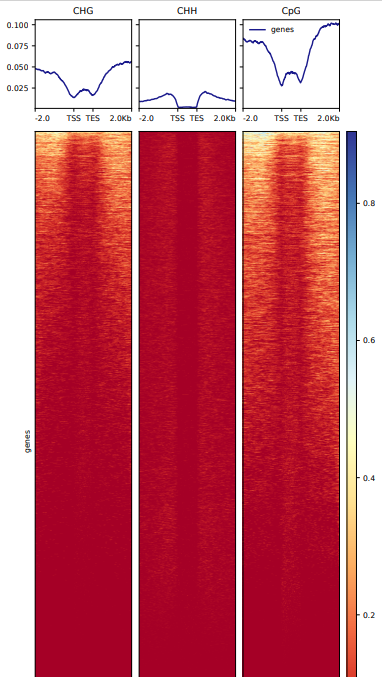
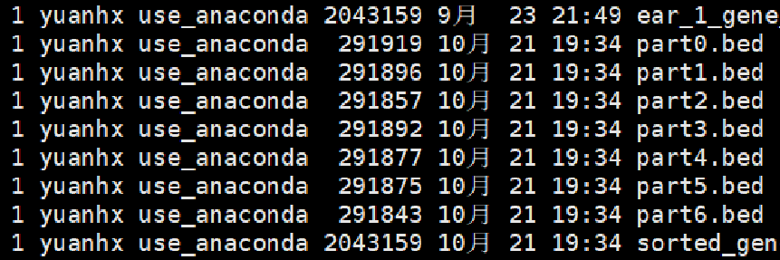

# 甲基化+组蛋白测序heatmap+profile绘制

使用deeptools的 `computeMatrix` + (`plotHeatmap` or `plotProfile`)可以针对某些特定类型的区域如TTS、TES的指定区域范围进行信号富集程度的可视化

## computeMatrix's parameters

computeMatrix提供两个不同参数（parameters）以指定不同的参考系

```shell
Commands:
  
    scale-regions  In the scale-regions mode, all regions in the BED file are
                   stretched or shrunken to the length (in bases) indicated by
                   the user.
    reference-point
                   Reference-point refers to a position within a BED region
                   (e.g., the starting point). In this mode, only those
                   genomicpositions before (upstream) and/or after (downstream)
                   of the reference point will be plotted.
```

对于reference-point，只指定一个参考点(TTS,TES,center),因此对于基因组区域文件 `<bed file(s)>`,不会对不同基因均一化，直接使用指定上游或者下游一段距离

对应scale-region,会均一化基因长度,使得不同基因TSS至TES之间区域长度一致。

```shell
  --regionBodyLength REGIONBODYLENGTH, -m REGIONBODYLENGTH
                        Distance in bases to which all regions will be fit. (Default:
                        1000)
  --binSize BINSIZE, -bs BINSIZE
                        Length, in bases, of the non-overlapping bins for averaging the
                        score over the regions length. (Default: 10)

```

在众多参数中，computeMatrix通过 `regionBodyLength`和 `binSize`来确定将不同基因分成相同分数的bin长度，使得基因长度均一化。

默认参数中 `regionBodyLength=1000` `binSize=10`，因此份数为1000/10=100，也就是将不同的基因统一切成100块，每一块参数对应一段bin内所有信号加和除以bin长度的平均值。

## 对不同组蛋白_ChIP-seq测序数据画图

针对与不同的目的蛋白结合的 DNA 片段进行测序数据，我们可以一次性输入多个对应的bigwig文件画成一张图。

具体代码:

```shell
bed=/home/ljx/yuanh/work_data/Ref_genome/220721_Maize_B73_V4/Maize_gene_1-10_chr.bed
for org_path in /home/yuanhx/dzx/230612_encher_data/0*; do
    org=$(basename $org_path | sed 's/^...//')

    bw_files=""
    for bw_id in $org_path/result/0*/bam/*bigwig; do
        bw_files="$bw_files $bw_id"  
    done
    computeMatrix scale-regions -p 10 \
        -b 2000 -a 2000 \
        -R $bed \
        -S $bw_files \
        --missingDataAsZero \
        --skipZeros -o $org_path/result/matrix_${org}_2K.gz

    plotHeatmap -m $org_path/result/matrix_${org}_2K.gz \
        -out /home/yuanhx/dzx/230612_encher_data/${org}_Heatmap_2K.png 
done
```


## 对甲基化测序数据画图

初始数据处理

```shell
$ head -100 output-prefix.bsmap.mkdup_CHG.bedGraph
track type="bedGraph" description="output-prefix.bsmap.mkdup CHG methylation levels"
1	1472	1473	100	9	0
1	1474	1475	90	311	34
1	1533	1534	75	6	2
1	1535	1536	69	99	43
1	1562	1563	33	3	6
1	1581	1582	37	3	5
1	1654	1655	50	2	2
1	1712	1713	75	9	3
1	1714	1715	100	3	0
```

直接使用原始bedGraph数据通过 **bedGraphToBigwig** 转换成bigwig文件画图，missingdata过多，热图黑色部分贼多

人工分bin，将1号染色体的最开始片段位置初始化0，按照100bp分段，对应的四列数据百分比处理

最后处理后的格式如下：

画图代码：

```shell
bed="/home/ljx/yuanh/work_data/Ref_genome/220721_Maize_B73_V4/Maize_gene_1-10_chr.bed"
for id in /home/yh/dzx/work/231017_methylation/methylation_bigwig_data/*;do
    org=`echo $id | cut -d '/' -f 8`
    echo "org:$org"
    bigwig_files=`ls $id/*.bigwig`
    echo -e "bigwig_files:\n$bigwig_files"

    computeMatrix scale-regions -p 10 \
        -b 2000 -a 2000 \
        -R $bed \
        -S $bigwig_files \
        --missingDataAsZero \
        --skipZeros -o /home/yh/dzx/work/231017_methylation/matrix/$org/matrix.gz
    echo "$org matrix.gz done"

    plotHeatmap -m /home/yh/dzx/work/231017_methylation/matrix/$org/matrix.gz \
        -out /home/yh/dzx/work/231017_methylation/plotHeatmap/$org/${org}_Heatmap_2K.pdf
    echo "$org heatmap done"
done
```



## 分表达水平高低绘制信号富集谱图

给基因区域bed文件赋值基因表达数据,将表达数据赋值至最后一列

```R
gene_bed <- read.table("gene_length.bed", header = F, sep = "\t", stringsAsFactors = F)
exp_data_1 <- read.csv("/home/yuanhx/dzx/work_data/exp_data/lai_py_expressed.csv", header = T)
exp_data_2 <- read.csv("/home/yuanhx/dzx/work_data/exp_data/yang_ear_tassel.csv", header = T)

gene_bed$V6 <- sub("ID=gene:", "", gene_bed$V6)
exp_data_1$tracking_id <- as.character(exp_data_1$tracking_id)
exp_data_2$tracking_id <- as.character(exp_data_2$tracking_id)
orgs <- c("ear_1", "ear_2", "shoot_1", "shoot_2", "tassel")
for (org in orgs){
    for (i in 1:nrow(gene_bed)){
        if(org %in% c("ear_1", "shoot_1","shoot_2")){
            if(gene_bed$V6[i] %in% exp_data_1$tracking_id == F){
                gene_bed$V8[i] <- "not_found"
                next
            }
            if(org %in% c("ear_1", "shoot_1")){
                gene_bed$V8[i] <- exp_data_1[which(exp_data_1$tracking_id == gene_bed$V6[i]), paste0("average.",sub("..$","",org))]
            }
            else if(org == "shoot_2"){
                gene_bed$V8[i] <- exp_data_1[which(exp_data_1$tracking_id == gene_bed$V6[i]), paste0(sub("..$","",org),".average")]
            }
        }
        else{
            if(gene_bed$V6[i] %in% exp_data_2$tracking_id == F){
                gene_bed$V8[i] <- "not_found"
                next
            }
            if(org == "ear_2") org = "ear"
            gene_bed$V8[i] <- exp_data_2[which(exp_data_2$tracking_id == gene_bed$V6[i]), paste0("average.",org)]
	    org = "ear_2"
        }
    }
    write.table(gene_bed, file.path(org, paste0(org, "_gene_exp",".bed")), row.names = F, col.names = F, sep = "\t")
}
```

做实验的提供的表达量数据格式真的是个无敌复杂，而且总是多次用到，应该找个时间优化一下格式

根据表达量切分bed文件

```shell
#!/bin/bash
data_dir="/home/yuanhx/dzx/org_gene_bed/"
for subdir in ear_1 ear_2 shoot_1 shoot_2 tassel; do
  echo "处理子目录: $subdir"
  cd "$data_dir$subdir"
  gene_exp_file=*gene_exp.bed
    # 对文件按照表达量排序
    sort -k 8,8n $gene_exp_file > sorted_gene_exp.bed
    split -d -n l/7 sorted_gene_exp.bed split_
    for ((i=0; i<7; i++)); do
      mv "split_0$i" "part$i.bed"
    done

    echo "处理完成: $gene_exp_file"
  cd "$data_dir"
done
```

处理后文件存放格式如此



画图

```shell
for id in /home/yuanhx/dzx/230612_encher_data/0*/result/0*/bam/*bigwig; do
    org=$(echo $id | awk -F'/' '{print $6}' | cut -c4-)

    bed_files=""
    for bed_id in /home/yuanhx/dzx/org_gene_bed/$org/part*.bed; do
        bed_files="$bed_files $bed_id"  
    done
    out_path=$(echo $id | cut -d'/' -f1-8)
    seq_name=$(basename $id | cut -d'.' -f1)
    computeMatrix scale-regions -p 11 \
        -b 2000 -a 2000 \
        -R $bed_files \
        -S $id \
        --missingDataAsZero \
        --skipZeros -o $out_path/matrix/${seq_name}_2k.gz
    plotProfile -m $out_path/matrix/${seq_name}_2k.gz  -out $out_path/matrix/${seq_name}_Profile_2K.png
done
```


 -S bigwig文件 -R bed文件可以分别传入多个

