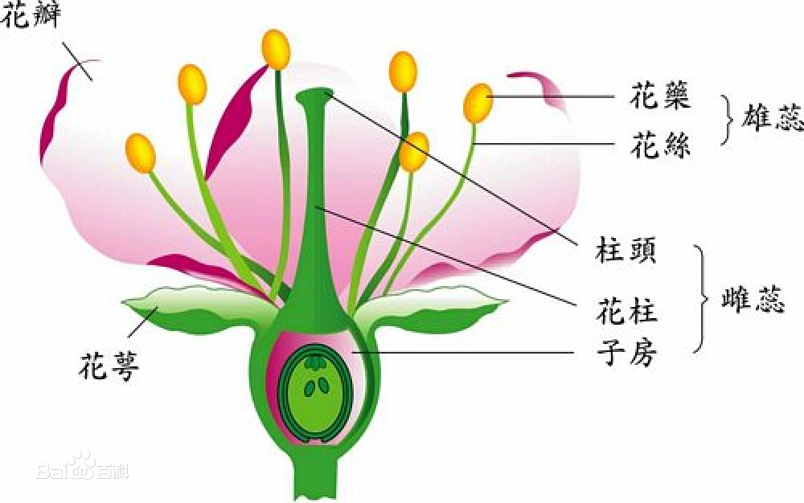
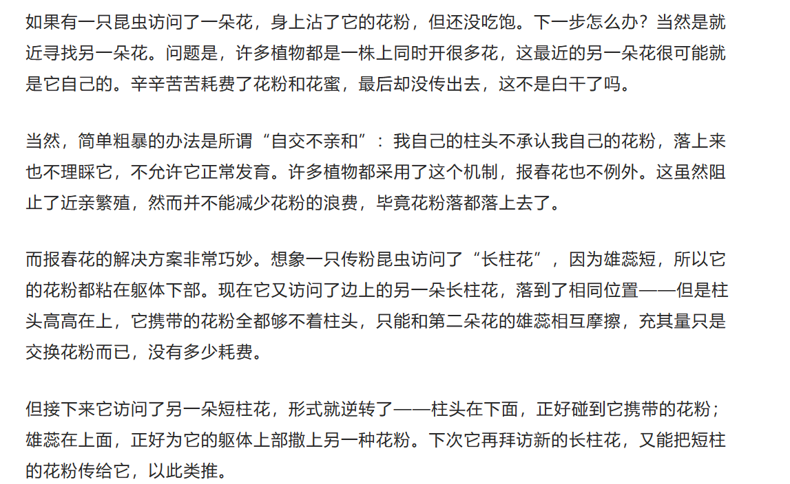
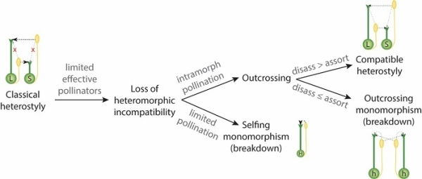
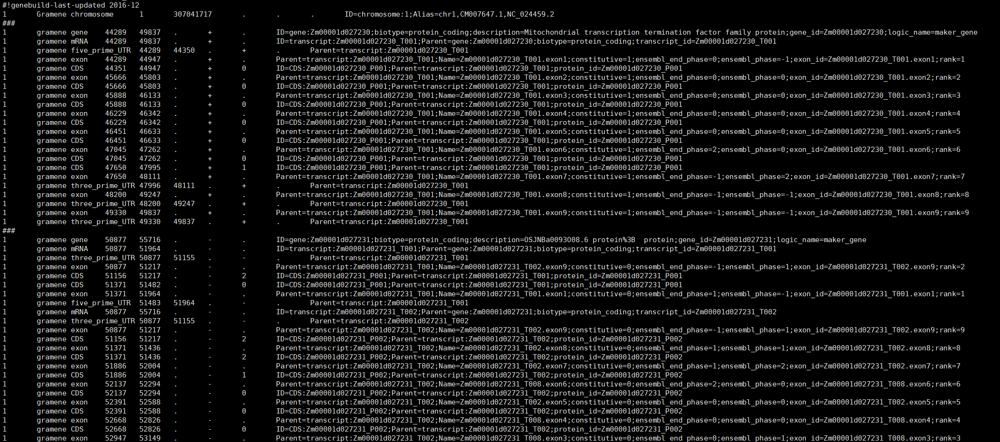

# 项目育人初体验

## 项目介绍

植物的自交不亲和性有许多原因，其中本项目所关注的异型花柱是其中之一，这种花的多态性结构至少出现在28个被子植物科中，准备搜集研究其中公共数据库中已有相关植物的基因组，对这些植物的基因组进行比较分析、共线性分析等，其中特别关注比较s位点上的超基因，去研究这些植物自交不亲和的差异以及相似性，帮助理解这些植物基因组的演化关系，以及s位点上的超基因的演化动态。

1. [ **基因组比较** ：接下来，可以使用synteny、mcscan、mummer等软件工具，对这些植物的基因组进行比较分析](https://www.jianshu.com/p/2e184e5c15b7)。可以通过比较s位点上的超基因，来研究这些植物自交不亲和性的差异和相似性。
2. [ **共线性分析** ：在基因组比较的基础上，还可以进行共线性分析](https://baijiahao.baidu.com/s?id=1715591836205248994)[。这将帮助你理解这些植物基因组的演化关系，以及s位点上超基因的演化动态](https://zhuanlan.zhihu.com/p/621752664)。

### 自交不亲和性（SI）Self-incompatibility

#### 概念

指具有 [完全花](https://baike.baidu.com/item/%E5%AE%8C%E5%85%A8%E8%8A%B1/5874539?fromModule=lemma_inlink)并可以形成正常雌、雄配子，但缺乏自花授粉结实能力的一种自交不育性。

陆地生物占地球生物总数的85%，其多样性与被子植物的起源和扩张密切相关。被子植物约有20多万种，是植物界最大的类群，但其形成和扩张的原因仍为未解之谜。现存被子植物中，约40%具有自交不亲和性 (Self-incompatibility, SI)。**SI是一种正常可育的雌雄同花被子植物自花授粉后不能产生合子的现象**，对于促进其异交并增加其多样性至关重要。

### 异型花柱(heterostyly)

根据[推文：武汉植物园在植物异型花柱分子遗传调控机制研究中取得新进展](https://mp.weixin.qq.com/s/PSVMjaIelvQ2C-UFYTYPxg)所说

* 具有异型花柱的物种通常同时具有自交不亲和机制
* 异型花柱在被子植物中广泛分布，已在28个科中被报道
* 异型花柱在遗传上是由S位点（一个超基因，由多个紧密连锁的基因组成，这些基因分别控制花柱长度或雄蕊高度等特征）决定的

#### 概念

**异型花柱是著名的花的多态性现象之一，表现为雌蕊与雄蕊的高度交互匹配，即交互式雌雄异位。雌蕊（花的雌性部分）和雄蕊（花的雄性部分）的长度和位置能够精确地匹配，以便在传粉过程中，雄蕊能够将花粉准确地传递到雌蕊上。**

插一个很有意思的科普推文  [上下三百年：“花柱异长”是怎么被发现的？| 果壳 科技有意思 (guokr.com)](https://www.guokr.com/article/440597)

从这篇推文的描述中看，似乎这个雌蕊与雄蕊的高度交互匹配，是长柱花的雌蕊和短柱花的雄蕊（或者相反）交互匹配，这样也导致花粉不同类型之间传播，而相同类型则断绝了传播，从而既不浪费又阻止了近亲繁殖。

由于基因突变以及生物因子（如传粉者）和非生物因子的共同作用，有时异型花柱多态性结构难以稳定维持，在群体间和群体内产生极大变异，最终促进植物交配系统的多样性演化,如上图所示。

#### 趋同进化

**研究发现，植物花柱异长独立演化超过了20次，这个复杂的多态现象已经成为了趋同进化的经典案例。**

对于趋同进化，最符合我们常识的是，植物界中，很多亲缘关系甚远的物种会在自然选择作用下表现出趋同进化现象，例如生活在干旱沙漠环境中的植物往往叶片退化成针状，高山植物大多矮化成垫状等。

在异型花柱这个性状中，自然环境带来的压力（想要成功繁殖，不同花型的植株之间需要匹配的花型以接收相同高度的繁殖器官之间的花粉流），使得一种花型的雄性和互补花型的雌性适合度得到增强，这样一来，选择压力会使得花柱异长的植物性别专化。

我们要研究是在目前发现的**异型花柱的形态趋同进化的背后是否隐藏着分子水平的趋同进化**。

### S位点（S-locus）

自交不亲和这一复杂性状由一个高多态性超基因*S*位点控制。

#### 概念

s位点是一种遗传位点，通常由单一复等位且包含紧密连锁的雌性和雄性S基因的S位点控制。

其中，1类S位点常包含一个S-核酸酶和多个SLF，分别编码雌性和雄性自交不亲和决定因子

* 雌性*S*基因编码一个T2类核酸酶即S-核酸酶
* 雄性*S*基因则编码多个C端为FBK或FBA结构域的F-box蛋白SLF

异交授粉时，由于多个SLF可协同识别并解除异己S-核酸酶的细胞毒性，因而产生异交亲和反应；而在自交授粉时，自己S-核酸酶的毒性由于无法被抑制，最终产生自交不亲和反应。 即我自己的柱头不承认我自己的花粉，落上来也不理睬它，不允许它正常发育

超基因是由多个基因组成的一个遗传单元，这些基因通常紧密连锁在一起，以便在遗传上一起传递。异型花柱是一种由超基因控制的花形态结构的多样性，

## [武汉植物园在植物异型花柱分子遗传调控机制研究中取得新进展](https://mp.weixin.qq.com/s/PSVMjaIelvQ2C-UFYTYPxg) 推文解读

* **异型花柱的研究对象** ：水生植物 **金银莲花** （Nymphoides indica），具有**长、短柱花**两种形态，由**S位点**决定。
* [ **基因组测序和关联分析** ：](https://edgeservices.bing.com/edgesvc/chat?udsframed=1&form=SHORUN&clientscopes=chat,noheader,udsedgeshop,channelstable,&shellsig=c9319c1362f174328caba0ccd86eeb602e77691b&setlang=zh-CN&darkschemeovr=1#sjevt%7CDiscover.Chat.SydneyClickPageCitation%7Cadpclick%7C0%7C243f6e35-ebcf-4a08-b365-3c5411119c0a%7C%7B%22sourceAttributions%22%3A%7B%22providerDisplayName%22%3A%22%E5%BC%82%E5%9E%8B%E8%8A%B1%E6%9F%B1%E5%9C%A8%E9%81%97%E4%BC%A0%E4%B8%8A%E6%98%AF%E7%94%B1...%22%2C%22pageType%22%3A%22html%22%2C%22pageIndex%22%3A1%2C%22relatedPageUrl%22%3A%22https%253A%252F%252Fmp.weixin.qq.com%252Fs%252FPSVMjaIelvQ2C-UFYTYPxg%22%2C%22lineIndex%22%3A6%2C%22highlightText%22%3A%22%E5%BC%82%E5%9E%8B%E8%8A%B1%E6%9F%B1%E5%9C%A8%E9%81%97%E4%BC%A0%E4%B8%8A%E6%98%AF%E7%94%B1S%E4%BD%8D%E7%82%B9%E5%86%B3%E5%AE%9A%E7%9A%84%EF%BC%8CS%E4%BD%8D%E7%82%B9%E6%98%AF%E4%B8%80%E4%B8%AA%E8%B6%85%E5%9F%BA%E5%9B%A0%EF%BC%8C%E7%94%B1%E5%A4%9A%E4%B8%AA%E7%B4%A7%E5%AF%86%E8%BF%9E%E9%94%81%E7%9A%84%E5%9F%BA%E5%9B%A0%E7%BB%84%E6%88%90%EF%BC%8C%E8%BF%99%E4%BA%9B%E5%9F%BA%E5%9B%A0%E5%88%86%E5%88%AB%E6%8E%A7%E5%88%B6%E8%8A%B1%E6%9F%B1%E9%95%BF%E5%BA%A6%E6%88%96%E9%9B%84%E8%95%8A%E9%AB%98%E5%BA%A6%E7%AD%89%E7%89%B9%E5%BE%81%E3%80%82%22%2C%22snippets%22%3A%5B%5D%7D%7D)构建了高质量的 **单倍型基因组** ，并通过**全基因组关联分析**发现了控制金银莲花异型花柱的 **S位点超基因** ，鉴定并解析了金银莲花中S位点**超基因**的演化和功能，发现了三个S位点**候选基因** - NinBAS1、NinKHZ2、NinS1。
* **S位点基因的功能和演化** ：研究团队探讨了S位点基因及其调控网络的潜在功能，以及**转座元件**和**逐步基因复制**对异型花柱超基因演化可能起到的作用。研究结果表明，**油菜素内酯**和**PIF分子调控网络**在金银莲花异型花柱的发育过程中具有重要的作用，为分子层面上异型花柱的趋同演化提供了进一步的证据。

## 花柱异型的科名录

[Ensembl Plants](http://plants.ensembl.org/index.html) Ensembl植物数据库

[花柱异型研究进展.pdf (book118.com)](https://max.book118.com/html/2017/0627/118334414.shtm) 在这篇2010年有关异型花柱的中文综述中提及为30多种

[Comparative Genomics Elucidates the Origin of a Supergene Controlling Floral Heteromorphism - PubMed (nih.gov)](https://pubmed.ncbi.nlm.nih.gov/35143659/)

A classic example of supergene is the S locus controlling heterostyly, a floral heteromorphism occurring in **28 angiosperm families.**

In Primula, heterostyly is characterized by the cooccurrence of two complementary, self-incompatible floral morphs and is **controlled by five genes clustered in the hemizygous, ca. 300-kb S locus.**

在这篇22年文章中

[‘A most complex marriage arrangement’: recent advances on heterostyly and unresolved questions (wiley.com)](https://nph.onlinelibrary.wiley.com/doi/epdf/10.1111/nph.16026)

针对下载的基因组

**通过GFF/GTF文件评估基因组注释完整性**

GFF（Generic Feature Format）, 描述了基因组上各种特征的区间信息，包括染色体，基因，转录本等。GFF文件 ‘\t’分隔的纯文本文件。

检查GFF文件，若显示有exon和CDS信息，则基因组注释相对完全，可用于分析。如果既没有exon信息，也没有CDS信息，则基因组注释信息缺失，需要等注释信息完善后才可以用于有参转录组分析的参考基因组。

## 参考

[自交不亲和性_百度百科 (baidu.com)](https://baike.baidu.com/item/%E8%87%AA%E4%BA%A4%E4%B8%8D%E4%BA%B2%E5%92%8C%E6%80%A7/5105784#2)

[被子植物自交不亲和性起源、丢失和重获的高度动态进化机制 (baidu.com)](https://baijiahao.baidu.com/s?id=1715591836205248994)

[华南植物园等在异型花柱植物的交配多样性演化研究中获进展----中国科学院 (cas.cn)](https://www.cas.cn/syky/202301/t20230119_4872922.shtml)

[武汉植物园在植物异型花柱分子遗传调控机制研究中取得新进展 (qq.com)](https://mp.weixin.qq.com/s/PSVMjaIelvQ2C-UFYTYPxg)

[上下三百年：“花柱异长”是怎么被发现的？| 果壳 科技有意思 (guokr.com)](https://www.guokr.com/article/440597)

[科学驿站｜最新研究：基因水平的趋同进化推动植物形态上的趋同进化_腾讯新闻 (qq.com)](https://new.qq.com/rain/a/20221113A03S3T00)

[中科院薛勇彪研究组合作揭示金鱼草基因组S位点超基因的动态演化机制 - 知乎 (zhihu.com)](https://zhuanlan.zhihu.com/p/621752664)

[遗传发育所等揭示被子植物自交不亲和性起源、丢失和重获的高度动态进化机制----中国科学院 (cas.cn)](https://www.cas.cn/syky/202111/t20211108_4813129.shtml)

[花柱异型研究进展.pdf (book118.com)](https://max.book118.com/html/2017/0627/118334414.shtm)

